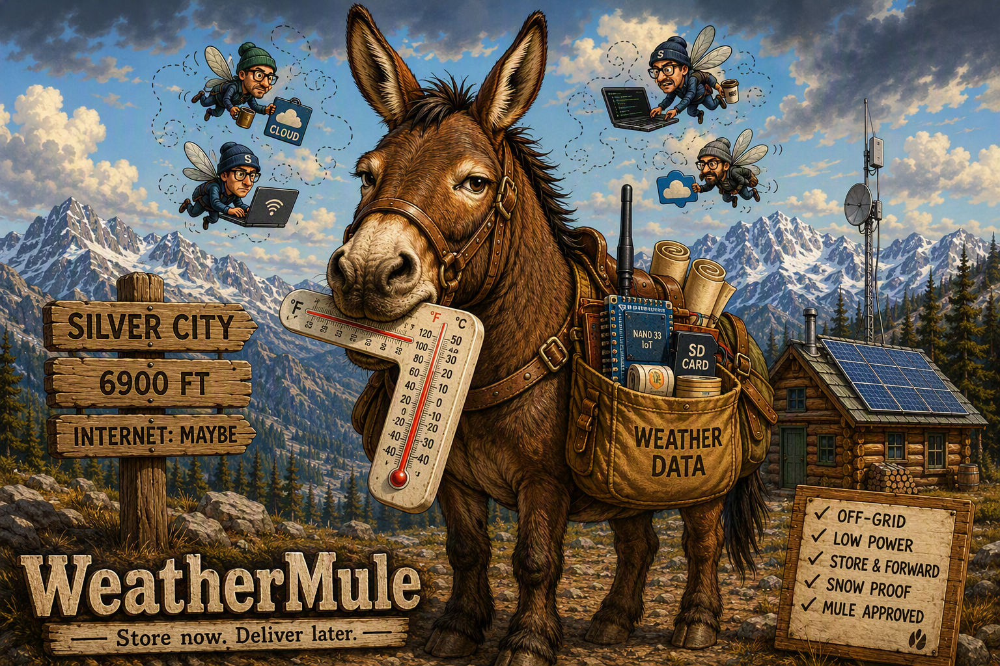

# WeatherMule

[Qick start](docs/quick-start.md) | [Use Case](docs/silver-city-use-case.md) | [Evolution](docs/project-evolution.md) | [Discovery](docs/protocol-discovery.md) | [Design](docs/design.md) 

**Store now. Deliver later.**

WeatherMule is a low-power, store-and-forward weather data relay designed for remote and off-grid locations where internet connectivity is unreliable, intermittent, or completely unavailable for extended periods. Running on an Arduino Nano 33 IoT with onboard Wi-Fi and SD card storage, WeatherMule receives weather observations, safely caches them locally, and patiently delivers them when network access becomes available.

## Why WeatherMule Exists

The original use case is a remote cabin in Silver City, California.

The cabin operates entirely from solar power and battery storage. Internet access is provided by a shared community Wi-Fi network that operates only when power and conditions permit. During the winter, deep snow can make the area inaccessible for months, and any equipment deployed must be able to operate unattended for extended periods.

Traditional cloud-connected weather station solutions assume a reliable internet connection. WeatherMule assumes the opposite.

If the internet is down, WeatherMule keeps collecting data.

If power is interrupted, WeatherMule preserves stored observations.

If connectivity returns days, weeks, or months later, WeatherMule resumes delivery.

Like the Sierra pack mules that once carried supplies into the mountains, WeatherMule carries weather data until it reaches its destination.

## Design Goals

- Low power operation
- Arduino-class hardware
- Reliable SD card storage
- Survive intermittent connectivity
- Recover gracefully from power loss
- Operate unattended for long periods
- Preserve data above all else
- Keep the design simple and maintainable

## Initial Hardware Target

- Arduino Nano 33 IoT
- Arduino SD Card / Connectivity Shield
- Ambient Weather WS2000 Weather Station
- Solar-powered off-grid network environment

## Project Status

Early design and prototyping.

The initial focus is understanding the WS2000 communication protocol, creating a durable local storage model, and implementing reliable store-and-forward delivery mechanisms suitable for long-term unattended operation.

## Philosophy

> The weather does not stop because the internet is down.

WeatherMule is intentionally designed around reliability, simplicity, and resilience rather than features, performance, or complexity.

When in doubt:

**Save the weather first. Figure everything else out later.**

---

*"Built for places where 'Internet: Maybe' is a valid network status."*
