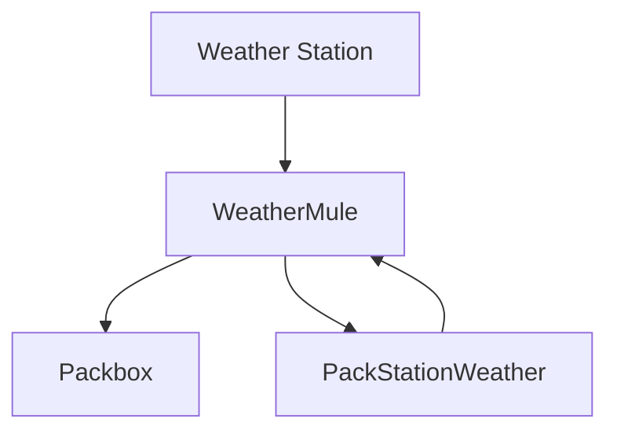
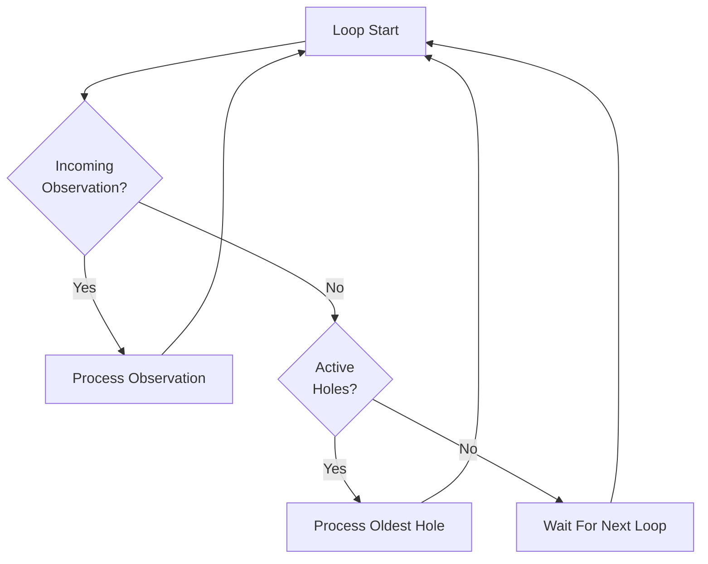
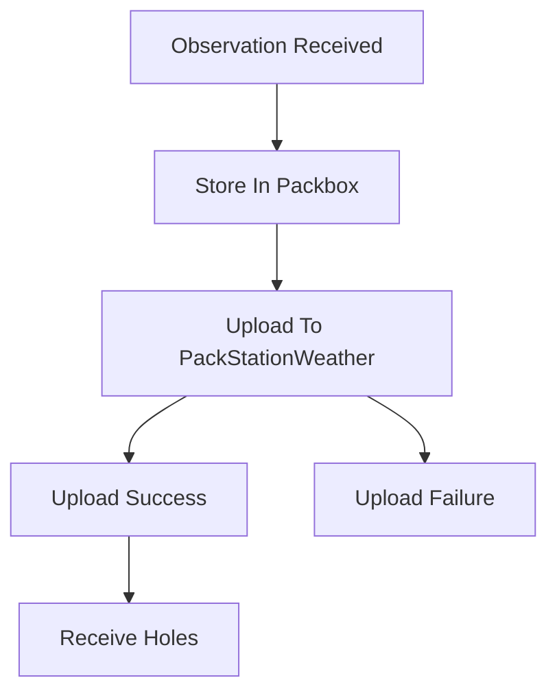
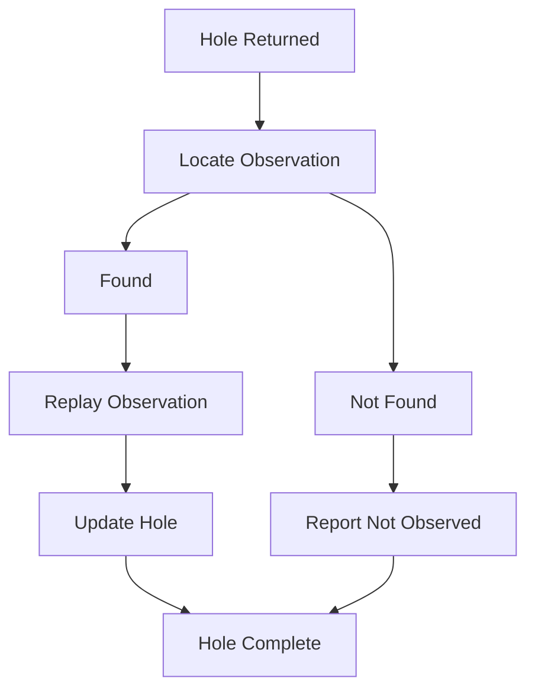

# Workflow

### Startup
  - Power is applied
  - WeatherMule starts
  - Connect to WiFi
  - Initialize SD storage
  - Begin listening for weather station requests
  - Enter main processing loop

### Main Processing Loop

- Main Processing Loop
  - Check for a weather station observation
    - If found
      - Process observation workflow
    - Else
      - Check for active holes
        - If holes exist
          - Process oldest hole
        - If no holes exist
          - Continue waiting

### Observation workflow

- Observation Processing
  - Receive observation from weather station
  - Create WeatherRequest from incoming request
  - Store original observation in Packbox
    - Determine Packbox from observation date
    - Create Packbox if necessary
    - Append observation
  - Attempt upload to PackStationWeather
    - If upload succeeds
      - Receive current hole list
      - Replace active hole list
      - Return success to weather station
    - If upload fails
      - Observation remains preserved in Packbox
      - Return appropriate response to weather station

- Authentication Workflow
  - Upload requested
  - Check for Session Token
    - If Session Token exists
      - Continue request
    - If Session Token missing
      - Perform Check-In
  - Check-In
    - Use Refresh Token if available
    - Otherwise use API Key
    - Request Session Token and Refresh Token
    - Store returned tokens
  - Authentication failure
    - Refresh Token rejected
      - Retry using API Key
    - API Key rejected
      - Authentication fails
      - Observation remains stored locally

- Upload Workflow
  - Serialize WeatherRequest
  - Submit observation to PackStationWeather
  - Receive response
  - Receive any holes identified by server
  - Update active hole list

### Hole Recovery

- Hole Processing Workflow
  - Select oldest hole
  - Locate Packbox containing hole start date
  - Search for observation matching FromUtc
    - If observation found
      - Execute Hole Fill Workflow
    - If observation not found
      - Execute Not Observed Workflow

- Hole Fill Workflow
  - Read next observation inside hole boundary
  - Upload observation to Hole Fill endpoint
  - If upload succeeds
    - Advance hole bookmark
    - Preserve progress information
  - If boundary reached
    - Remove hole from active list
  - Return to main loop

- Not Observed Workflow
  - Determine requested observation cannot be located
  - Notify PackStationWeather
  - Remove hole from active list
  - Return to main loop

### Packbox Workflow
  - Determine UTC observation date
  - Map date to Packbox filename
  - Append original observation
  - Never modify previously written observations
  - Use stored observations as recovery source

### Recovery Workflow
  - Communication outage occurs
    - Observations continue to be stored
    - Uploads may fail
  - Communication restored
    - New observation uploads succeed
    - PackStationWeather identifies missing observations
    - Holes are returned
    - Hole recovery begins
    - Missing observations replayed from Packboxes

### Shutdown or Restart
  - Device loses power or reboots
  - Packboxes remain intact
  - Startup workflow resumes
  - Stored observations remain available for future recovery

### Continuous Operational Goal
  - Preserve observations
  - Deliver observations
  - Recover missing observations
  - Operate unattended
  - Lose no observation that was successfully written to a Packbox