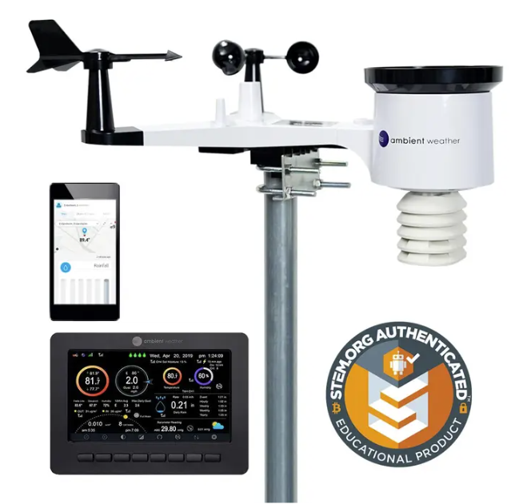

# Ambient Weather WS-2000

The WeatherMule project was originally developed around an Ambient Weather WS-2000 weather station.

WeatherMule does not replace the weather station.

It sits between the weather station and the internet, preserving observations during connectivity outages and forwarding them when network access becomes available.

For WeatherMule, the WS-2000 is the source of the cargo.

The mule just carries it.

[WS-2000 Manual](https://ambientweather.com/mwdownloads/download/link/id/1113)

