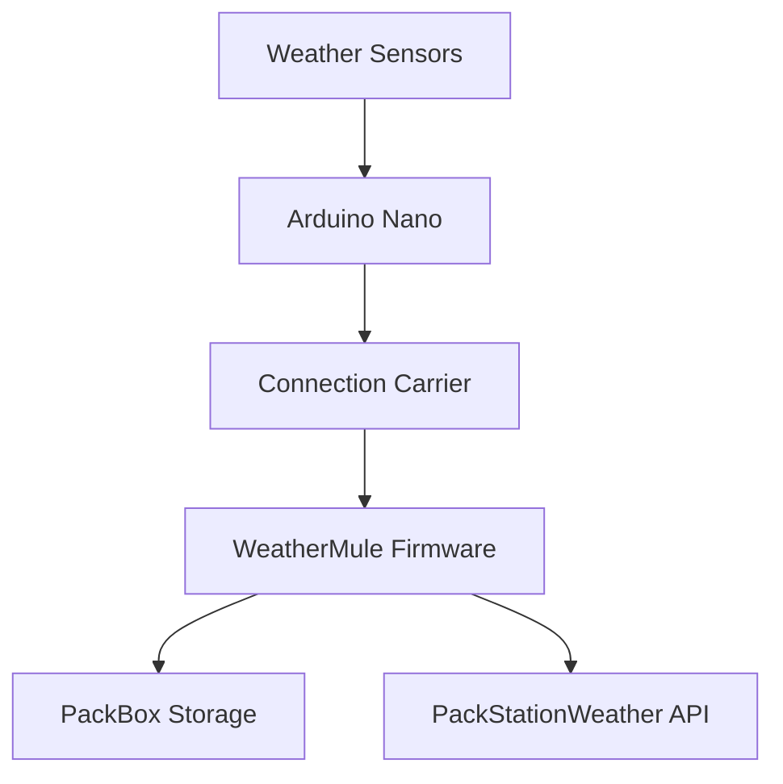

# Arduino Nano Hardware

The PackStationWeather field stations use an Arduino Nano as the primary data acquisition controller. The Nano is responsible for collecting sensor measurements, managing local device interfaces, buffering readings as needed, and communicating with the WeatherMule data transport subsystem.

## Why the Nano?

The Arduino Nano provides several advantages for remote weather station deployments:

- Low power consumption
- Proven reliability in field environments
- Compact form factor
- Extensive sensor library support
- Simple USB programming and debugging
- Large community support and documentation

These characteristics make the Nano a practical choice for unattended deployments where stability and recoverability are more important than raw processing power.

## Architecture

The Nano serves as the weather station's edge controller.

Responsibilities include:

- Reading weather sensors
- Collecting environmental measurements
- Managing station health information
- Maintaining local operational state
- Providing data to WeatherMule for transport to PackStationWeather

## Connection Carrier

The Arduino Nano is mounted on a Connection Carrier board.

There is no technical requirement to use this specific carrier. The primary reason it was selected is because there was one sitting in the parts drawer when the project started.

That said, it turned out to be a convenient choice because it provides screw-terminal connections, simplifies wiring, and makes field maintenance easier than loose jumper wires.

WeatherMule does not depend on any proprietary carrier-board functionality. The carrier simply provides convenient access to the Nano's I/O pins.

## Documentation

### Arduino Nano

Official hardware documentation:

https://docs.arduino.cc/hardware/nano-33-iot/

### Connection Carrier

Connection Carrier documentation:

https://docs.arduino.cc/hardware/nano-connector-carrier/

## Operating Environment

The Nano is designed to operate continuously in remote field locations. Weather station enclosures should provide protection from:

- Moisture
- Condensation
- Direct precipitation
- Dust
- Insects
- Excessive heat exposure

All external wiring should include proper strain relief and weather-resistant connectors appropriate for the deployment environment.

## Deployment Notes

The Nano firmware is developed specifically for the PackStationWeather ecosystem and may differ from reference Arduino examples.

When deploying or updating a station:

1. Verify firmware version.
2. Verify sensor connectivity.
3. Verify WeatherMule communication.
4. Verify accurate timestamps.
5. Confirm successful data delivery to PackStationWeather.

A successful deployment allows the station to collect weather observations locally while WeatherMule handles transport, synchronization, and recovery of missing observations.

