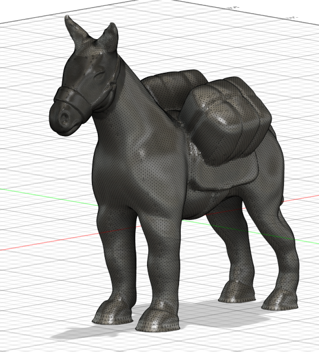

# WeatherMule Enclosure Concept

This document describes a proposed enclosure concept for WeatherMule.

The enclosure has not yet been printed, assembled, or field tested. At the time of writing, it exists only as a digital model and a growing list of ideas.

## Background

Most electronics projects eventually end up inside a generic plastic box.

While there is nothing wrong with that approach, the WeatherMule project presents a unique opportunity.

If the firmware responsible for collecting, storing, and delivering weather observations is called *WeatherMule*, perhaps the enclosure should look the part.

The current concept explores using a 3D printed pack mule as the enclosure for the Arduino Nano and Connection Carrier.

## Design Goals

The enclosure should:

- Protect the Arduino Nano and Connection Carrier
- Provide access to power and sensor connections
- Allow maintenance and firmware updates
- Be printable on a consumer-grade 3D printer
- Be easy to assemble and service
- Add a little personality to the project

The intent is not to create a sculpture. The intent is to create a practical enclosure that also happens to look like the project it contains.

## Why a Mule?

WeatherMule acts as a transporter of observations.

When a weather station reports data, the mule receives it, stores it when necessary, and delivers it to PackStationWeather when connectivity is available.

It is only fitting that the Arduino Nano should reside within the belly of a pack mule. After all, if the firmware is called WeatherMule, the hardware ought to look capable of carrying a few PackBoxes up a mountain trail.

## Proposed Layout

The current concept places the Arduino Nano and Connection Carrier within the body of the mule.

The saddlebags provide an interesting opportunity for future expansion and visual feedback.

Possible uses include:

- E-ink status displays
- Project branding
- Station identification
- Weather summaries
- Battery or power information
- Connectivity status

The final arrangement has not yet been determined and will likely evolve as prototypes are tested.

## Electronics

The current WeatherMule hardware is intentionally simple.

The design presently consists of:

- Arduino Nano
- Connection Carrier

WiFi connectivity is provided directly by the Nano, eliminating the need for additional networking hardware.

The enclosure should therefore remain relatively compact while still leaving room for future enhancements.

## Printing Considerations

Several design questions remain open:

- Should the mule be printed as a single assembly or multiple sections?
- How should access be provided to the electronics?
- Should the saddlebags be removable?
- How can wiring be routed cleanly?
- What level of weather resistance is practical?

These questions will be answered through prototype iterations as development progresses.

## Current Status

The enclosure remains a concept.

The CAD model represents an early design direction rather than a finished product.

As ideas go, however, it seems more appropriate than yet another anonymous project box.

Some projects hide their electronics in a plastic enclosure.

WeatherMule may eventually carry them in a saddlebag.