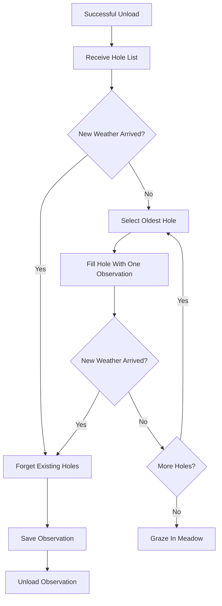
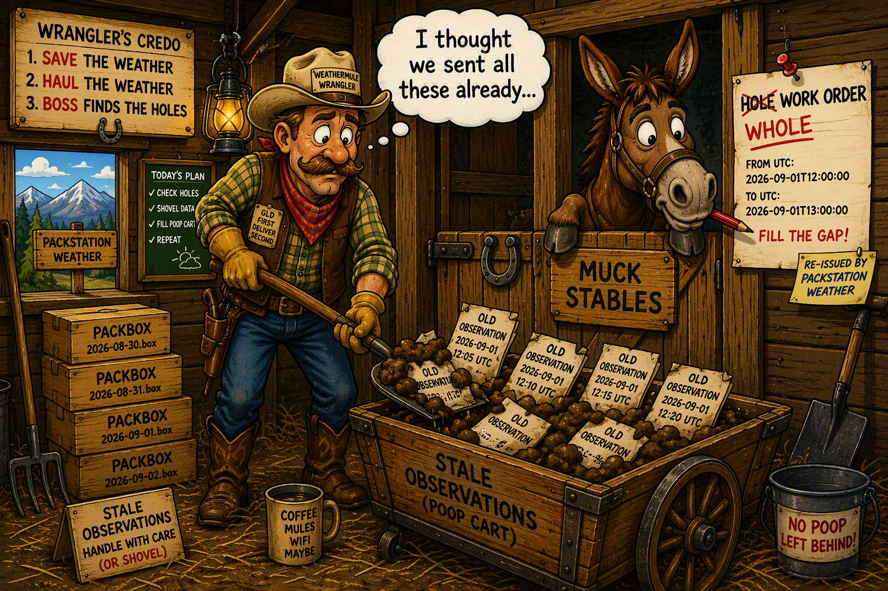

## Hole Processing

Hole processing is background work.

The mule only works holes when there is no fresh weather waiting to be hauled.

**Fresh weather always wins.**

After a successful unload, PackStationWeather may return a list of holes. These holes become the mule's current work orders.



WeatherMule never attempts to completely process a hole before checking for fresh weather.

It fills a single observation.

Then it looks up.

If new weather has arrived, the mule drops the shovel, forgets its current holes, and returns to hauling cargo.

If no new weather has arrived, the mule selects the oldest remaining hole and fills another observation.

Eventually one of three things happens:

- New weather arrives.
- The hole is completed or removed.
- There are no holes left to process.

The first outcome is the most important.

The weather station creates new cargo every few minutes. The mule must always be ready to stop maintenance work and return to hauling weather.

That is why hole processing feels less like synchronization and more like mucking stalls.

The work is useful.

The work is necessary.

But the instant new cargo arrives, everyone puts down the shovel and gets back to moving weather.



### How the Mule Fills a Hole

_Implementation:_

- [_HoleRoutines.h_](../../HoleRoutines.h)
- [_Hole.h_](../../Hole.h)
- [_StorageRoutines.h_](../../StorageRoutines.h)

At first glance, a hole appears to describe missing weather.

```json
{
    "fromUtc": "2026-09-01T12:00:00",
    "toUtc": "2026-09-01T13:00:00"
}
```

The important detail is that neither boundary observation is missing.

PackStationWeather already possesses the observation at `fromUtc`.

PackStationWeather already possesses the observation at `toUtc`.

What may be missing is everything between them.

This makes recovery much simpler than it first appears.

The mule does not need to calculate where recovery should begin. It starts from a known observation and works forward toward another known observation.

### Finding the Starting Point

The mule opens the packbox containing the `fromUtc` observation and searches until it finds that exact observation.

On the first pass, this may require scanning the packbox.

Once the mule begins filling the hole, it also maintains a `ByteOffset`. This byte offset points to the beginning of the observation currently identified by `fromUtc`.

The byte offset is not the recovery progress.

It is an internal bookmark that allows the mule to return directly to the current `fromUtc` observation instead of scanning the packbox from the beginning again.

The mule verifies that the observation at the bookmarked location still matches `fromUtc`. Only then does it continue.

The real progress marker is `fromUtc`.

### Recovering an Observation

After locating the observation identified by `fromUtc`, the mule advances to the next observation in the packbox.

That next observation becomes the recovery candidate.

If the candidate's `dateutc` does not match `toUtc`, the observation falls inside the hole and is sent to PackStationWeather.

```http
POST /api/unload/hole/fill
```

After PackStationWeather accepts the observation, the hole advances.

For example, the original hole may be:

```text
FromUtc = 12:00
ToUtc   = 13:00
```

The mule finds the `12:00` observation and advances to:

```text
12:05
```

The `12:05` observation is sent to PackStationWeather, and the hole becomes:

```text
FromUtc         = 12:05
ToUtc           = 13:00
PartiallyFilled = true
```

The byte offset now identifies the `12:05` observation in the packbox.

The next time the mule processes the hole, it returns to the `12:05` observation, verifies that the timestamp matches `FromUtc`, and advances to the following observation.

If the following observation is `12:10`, the mule sends `12:10` to PackStationWeather and advances the hole again:

```text
FromUtc         = 12:10
ToUtc           = 13:00
PartiallyFilled = true
```

In effect, the hole slowly shrinks as the mule walks through the packbox one observation at a time.

### Reaching the Far Side of the Hole

Eventually, the next observation in the packbox is the observation identified by `toUtc`.

At that point, there are two possible outcomes.

#### Weather Was Recovered

If:

```text
observation.dateutc == hole.ToUtc
```

and:

```text
hole.PartiallyFilled == true
```

then one or more observations were successfully recovered from inside the hole.

The mule has reached the known observation at the far side of the gap.

The work order is complete, and the hole can be removed.

The `toUtc` observation is not sent again because PackStationWeather already possesses it.

#### Nothing Was Ever Observed

If:

```text
observation.dateutc == hole.ToUtc
```

and:

```text
hole.PartiallyFilled == false
```

then the mule traveled directly from the starting observation to the ending observation without finding anything in between.

No weather was recovered because there were no intermediate observations recorded in the packbox.

In this case, the mule sends the hole itself to:

```http
POST /api/unload/hole/not/observed
```

This tells PackStationWeather that the mule checked the packbox and found no observations within that range. PackStationWeather can then stop requesting recovery for that hole.

### Why This Works

The mule never calculates what observations are missing.

The mule never maintains a separate synchronization ledger.

The mule never tracks recovery progress outside the hole itself.

`FromUtc` identifies the current known observation.

`ToUtc` identifies the known observation at the far side of the gap.

`ByteOffset` helps the mule quickly return to the current `FromUtc` observation.

`PartiallyFilled` records whether any observations have been recovered from inside the hole.

The hole is the work order.

The hole is the recovery cursor.

The hole is the progress tracker.

The hole is also expendable.

It does not need to be completed before new weather arrives. If fresh weather appears, the mule forgets its current holes and returns to hauling cargo.

PackStationWeather keeps the books.

The mule checks the packboxes.

The hole merely tells the mule where to look next.