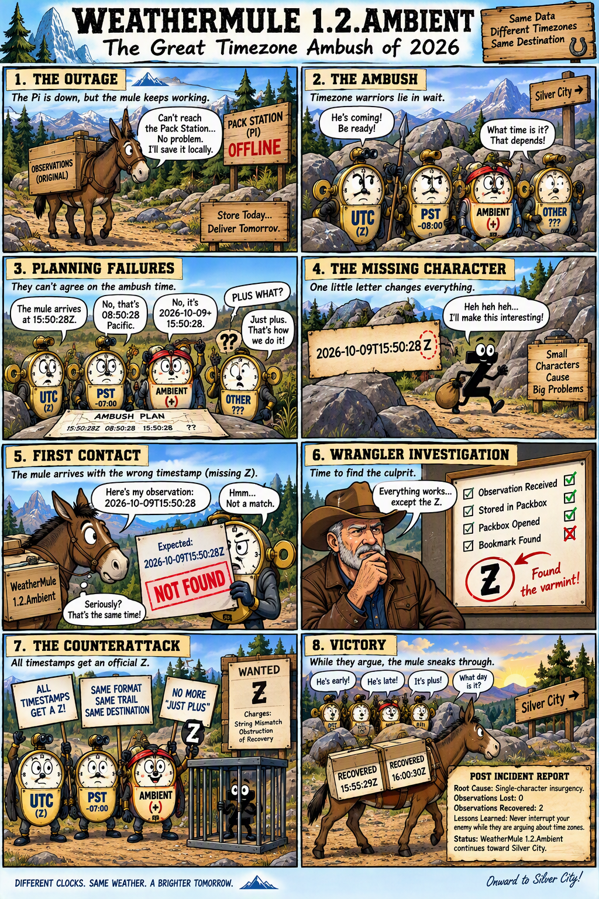

# The Great Timezone Ambush

*October 9, 2026*

The plan seemed simple enough.

Turn off the Pack Station.

Let the mule wander around for a while carrying weather cargo.

Turn the Pack Station back on.

Watch the mule recover the missing observations and proudly deliver them.

The plan worked almost perfectly.

Which, unfortunately, is sometimes much worse than having the plan fail completely.

The Pack Station was shut down and the mule was left on the trail.

Every few minutes the weather station produced another observation. The mule accepted each observation, loaded it into the appropriate packbox, attempted delivery, discovered the station was unavailable, and continued on its way.

Everything looked normal.

The mule was doing exactly what it had been trained to do.

After a few observations had accumulated, the Pack Station was brought back online.

The next weather observation arrived.

The mule loaded the observation into a packbox, arrived at the Pack Station, unloaded fresh cargo, received a hole assignment, opened the correct packbox, and began looking for the missing observations.

Then things became strange.

Instead of reporting recovered observations, the mule reported:

```text
NotObserved
```

This was troubling for a very simple reason.

The weather absolutely had been observed.

The observations were sitting in the packbox.

Everyone knew the observations were in the packbox.

The mule knew.

The wrangler knew.

The Pack Station knew.

Yet somehow the mule was searching for cargo that appeared to be standing directly in front of it.

The investigation began.

At first the usual suspects were rounded up.

Was the packbox missing?

No.

Was the wrong packbox being opened?

No.

Was recovery running?

Yes.

Was the hole assignment wrong?

Apparently not.

The mule was opening the correct packbox and searching exactly where it had been told to search.

Eventually additional logging was added and the mule finally revealed what it was looking for.

The Pack Station had instructed the mule to find:

```text
2026-10-09T15:50:28Z
```

The mule opened the packbox and found:

```text
dateutc=2026-10-09+15:50:28
```

The wrangler stared at the timestamps.

The mule stared at the timestamps.

The timestamps stared back.

They were obviously the same moment in time.

The problem was that the mule was not comparing moments.

The mule was comparing identifiers.

After normalizing the observation, the mule produced:

```text
2026-10-09T15:50:28
```

The Pack Station was searching for:

```text
2026-10-09T15:50:28Z
```

A single character had slipped onto the trail.

The infamous:

```text
Z
```

The observations represented the same moment.

The strings did not.

The mule searched faithfully for:

```text
2026-10-09T15:50:28Z
```

The normalized packbox observation was:

```text
2026-10-09T15:50:28
```

The match failed.

The mule concluded the observation did not exist.

No amount of arguing about philosophy, timezones, or relativity was going to convince a string comparison otherwise.

The timestamps were normalized.

The missing Z was returned to civilization.

The outage test was run again.

This time the mule opened the packbox, found the correct observation, recovered the missing cargo, and delivered it exactly as intended.

The incident might have ended there.

Instead it raised a more interesting question.

WeatherMule currently understands Ambient Weather observations because WeatherMule was trained on Ambient Weather observations.

But what happens when another weather station arrives?

What happens when one manufacturer uses:

```text
2026-10-09+15:50:28
```

and another uses:

```text
2026-10-09T15:50:28Z
```

and another uses:

```text
2026-10-09T15:50:28-07:00
```

and yet another decides timestamps should be represented by interpretive dance and hexadecimal?

The incident suggested a better trail.

Rather than teaching every mule every weather station dialect, perhaps the Pack Station should provide a manifest describing the station's cargo.

The manifest could tell the mule how to recognize a station, which field identifies the observation time, and how that station represents its timestamps. The mule could then use the manifest to build the key/value pairs, select the proper packbox, create the observation, and process holes without carrying every vendor's conventions permanently in firmware.

The mule would learn from the manifest instead of carrying vendor knowledge in firmware.

The Great Timezone Ambush therefore accomplished two things.

The mule recovered its missing cargo.

The wrangler discovered part of the road leading toward a future multi-vendor WeatherMule.

And somewhere in the mountains, four Timezone Warriors are probably still arguing about whether the mule was early, late, or exactly on time.

---


