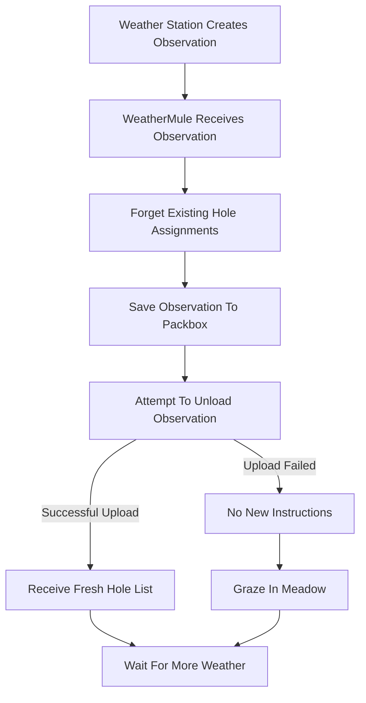
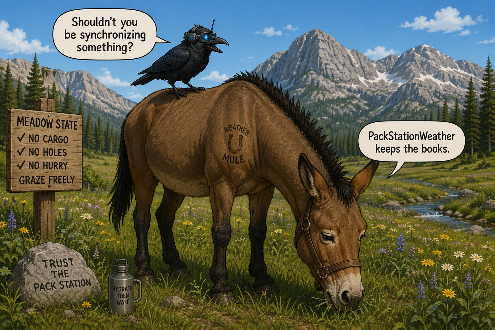

## The Life of a Weather Observation

Before discussing packboxes, authentication, unloading cargo, or holes, it helps to understand the life of a weather observation.

WeatherMule was intentionally designed around a very small number of priorities.

1. Preserve new weather.
2. Attempt delivery.
3. Follow instructions from the pack station.
4. Wait patiently.

Everything else exists to support those goals.

### The Prime Directive

The mule's first responsibility is not synchronization.

The mule's first responsibility is not authentication.

The mule's first responsibility is not historical recovery.

The mule's first responsibility is preserving weather.

A weather observation that has not yet been written to a packbox can still be lost.

A weather observation resting safely in a packbox can always be delivered later.

That distinction shaped the entire architecture.

The design philosophy became:

> Save the weather first. Figure everything else out later.

### The Observation's Journey

Every weather observation follows the same general path.

At first glance, one step often surprises people:

**Forget Existing Hole Assignments**

Why would a synchronization system intentionally forget work?

That question eventually became one of the most important architectural discoveries in the project.

The answer is simple.

The mule is not responsible for synchronization.

The pack station is.

### Learning To Forget

Early versions of the design assumed the mule would keep track of missing weather.

It would determine what had been uploaded.

It would determine what remained missing.

It would decide what to synchronize next.

The more this idea was explored, the more complicated the mule became.

Eventually a simpler realization appeared.

PackStationWeather already knows what observations have arrived.

PackStationWeather already knows what observations are missing.

PackStationWeather is the only part of the system capable of seeing the complete picture.

The mule cannot.

A mule only knows what cargo it currently carries.

Once that realization occurred, synchronization responsibility moved entirely to the pack station.

The mule no longer needed to remember old instructions.

It simply needed to follow the newest instructions it received.

### Fresh Weather Always Wins

The newest observation always takes priority.

If fresh weather arrives while the mule is doing something else, the mule immediately switches its attention to the new cargo.

This behavior is intentional.

Weather becomes historical weather soon enough.

The first responsibility is ensuring that the newest observation survives long enough to become historical weather.

Everything else can wait.

### What Happens If Delivery Fails?

Sometimes the internet is unavailable.

Sometimes the pack station cannot be reached.

Sometimes mountain networking decides to remind everyone who is really in charge.

In those situations the observation remains safely stored in a packbox.

Nothing is discarded.

Nothing is lost.

The mule does not need to calculate recovery plans or maintain synchronization state.

It simply preserves the weather and waits for another opportunity to unload cargo.

Eventually the pack station will notice the missing observations and issue new work orders.

Today's failed delivery is tomorrow's hole to fill.

### The Big Idea

Many systems attempt to keep synchronization state in multiple places.

WeatherMule deliberately does not.

PackStationWeather keeps the books.

WeatherMule carries cargo.

The mule preserves observations.

The pack station determines what is missing.

The mule follows instructions.

That single design decision removed a surprising amount of complexity from the project.

The mule became smaller.

The pack station became smarter.

The weather became safer.

And when there is no cargo to carry and no instructions to follow, the mule does what every sensible mule does.

It goes to the meadow and grazes.

