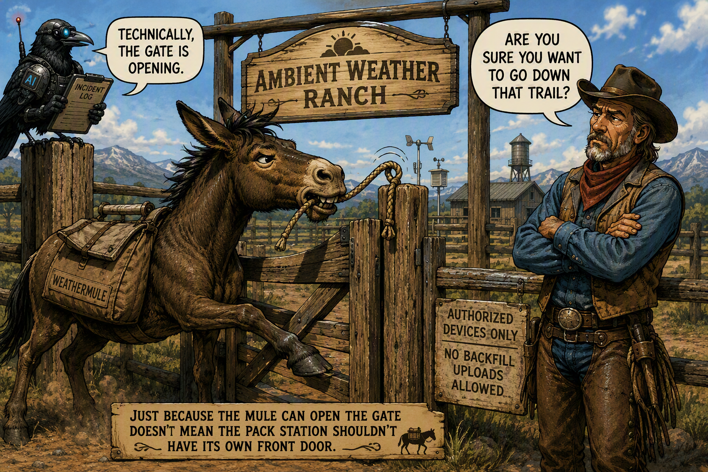
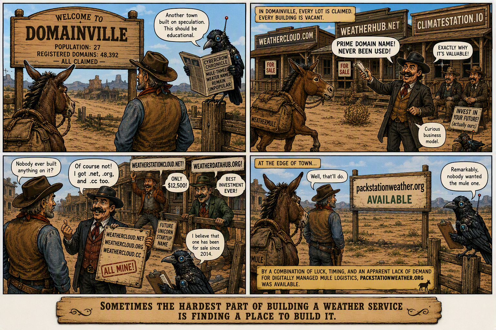
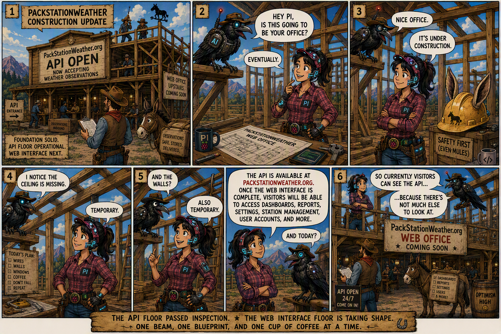

# Building Our Own Pack Station

The original plan for WeatherMule was much simpler.

The weather station already knew how to send observations to Ambient Weather. The mule merely needed to preserve those observations during an outage and deliver them once connectivity returned.

On paper, the problem appeared nearly solved.

The weather station generated observations.

WeatherMule would hold them.

Ambient Weather would receive them later.

Simple.

At least until somebody asked a very important question:

> How do we upload historical observations back to Ambient Weather after the connection returns?

That question led to an uncomfortable discovery.

## The Missing Door

Ambient Weather provided ways for weather stations to submit observations.

Ambient Weather provided ways for applications to retrieve observations already stored in their systems.

What Ambient Weather did not appear to provide was a supported mechanism for uploading a backlog of historical observations after an outage.

The protocol was clearly intended for real-time reporting.

WeatherMule's entire purpose was delayed reporting.

Those two goals were not necessarily compatible.

The more the protocol was examined, the more it became apparent that recovered observations were not a problem Ambient Weather expected somebody else to solve.

## The Temptation

Of course, engineers rarely stop at the first appearance of a closed gate.

Questions began to appear.

Questions such as:

- Could WeatherMule simply pretend to be the weather station?
- Could stored observations be replayed later?
- Would Ambient Weather know the difference?
- Would anyone care?

These tend to be the kinds of questions that precede either a clever solution or a regrettable amount of troubleshooting.

The weather station protocol was visible.

The requests could be captured.

The observations could be stored.

In theory, WeatherMule could likely generate requests that looked remarkably similar to genuine weather station traffic.

But there was an important difference between:

> It might work.

and

> It was designed to work.

The first is engineering curiosity.

The second is architecture.

## Building on Sand

Even if replaying observations proved successful, the entire solution would depend on behavior that was never intended for historical synchronization.

Undocumented behavior has an unfortunate habit of remaining operational right up until the moment it does not.

A firmware update could change it.

A service update could change it.

An API redesign could change it.

An infrastructure migration could change it.

And when it stopped working, there would be no contract guaranteeing what had changed or how to fix it.

WeatherMule was being built for mountain outages.

The most interesting weather observations were often collected during the exact moments the network was least reliable.

Building the recovery path upon assumptions and good luck seemed like the wrong foundation for preserving those observations.

The mule deserved better cargo handling than that.

## The Realization

Eventually the problem became clear.

WeatherMule already knew how to preserve observations.

What it lacked was a destination willing to accept observations that arrived hours, days, or even weeks after they were originally recorded.

The obvious answer was to build our own weather service.

Such a service could be designed around the realities of mountain networking instead of assuming a permanent internet connection. It could accept delayed observations, track missing data, request recovery of gaps, and synchronize observations whenever connectivity returned.

In other words, it could be built specifically for a weather system whose cargo was being delivered on the back of a mule.

## Building Our Own Pack Station

Once that idea appeared, the name followed naturally.

If weather observations were traveling in packboxes carried by a WeatherMule, then the destination ought to be a pack station.

Thus, PackStationWeather was born.

Admittedly, practical considerations also played a role.

Modern domain registration often resembles a land rush conducted entirely by squatters.

Every obvious variation of:

- weather
- climate
- station
- forecast
- weather-data
- weather-cloud
- weather-hub
- weather-service

had already been claimed by somebody, somewhere, for reasons known only to them.

Fortunately, by a combination of luck, timing, and an apparent lack of public interest in digitally managed mule logistics, **packstationweather.org** was available.

The wrangler considered this a sign.

The mule finally had somewhere to unload its cargo.

## A Station Designed for Mules

Unlike traditional weather services, PackStationWeather would not treat delayed observations as a problem.

Delayed delivery was the entire point.

The service could be designed around assumptions that matched reality:

- Connectivity may disappear.
- Observations may arrive late.
- Observations may arrive out of order.
- Historical recovery is normal.
- Missing observations should be detected.
- Recovery requests should be generated automatically.
- Duplicate observations should be ignored safely.

Instead of forcing delayed synchronization into a system that was never designed for it, the system itself could embrace delayed synchronization as a first-class feature.

The weather service could finally understand the realities of mountain weather instead of pretending network outages never happen.

## The Road Not Taken

Could WeatherMule have attempted to replay observations directly into Ambient Weather?

Perhaps.

It might even have worked.

For a while.

But WeatherMule was never intended to become a protocol impersonation project.

The goal was to preserve weather observations, not discover how many undocumented assumptions could be balanced on top of each other before something fell over.

Building PackStationWeather transformed the project.

WeatherMule stopped being a relay.

It became part of a complete system.

The mule no longer needed to sneak cargo through somebody else's gate.

It finally had a pack station of its own.

## An Unexpected Construction Project

One small detail remained.

PackStationWeather did not exist.

When WeatherMule began, the plan was simply to build a reliable store-and-forward relay for weather observations. The destination was expected to be somebody else's system.

PackStationWeather was never part of the original roadmap.

It emerged in the middle of development after the historical synchronization problem became impossible to ignore.

The realization that WeatherMule needed a destination designed for delayed delivery created an entirely new project.

Unfortunately, creating a new weather service takes considerably longer than naming one.

While WeatherMule continued to mature, PackStationWeather started from scratch.

Authentication needed to be designed.

Observation storage needed to be built.

Hole detection needed to be implemented.

APIs needed to be written.

Reports, dashboards, station management, and user interfaces still lay ahead.

By the time WeatherMule was approaching its first public release, the pack station itself looked more like a construction site than a finished destination.

The mule already knew where it was going.

The station crews were still raising the walls.

One thing was immediately clear.

Pi still needed an office.

