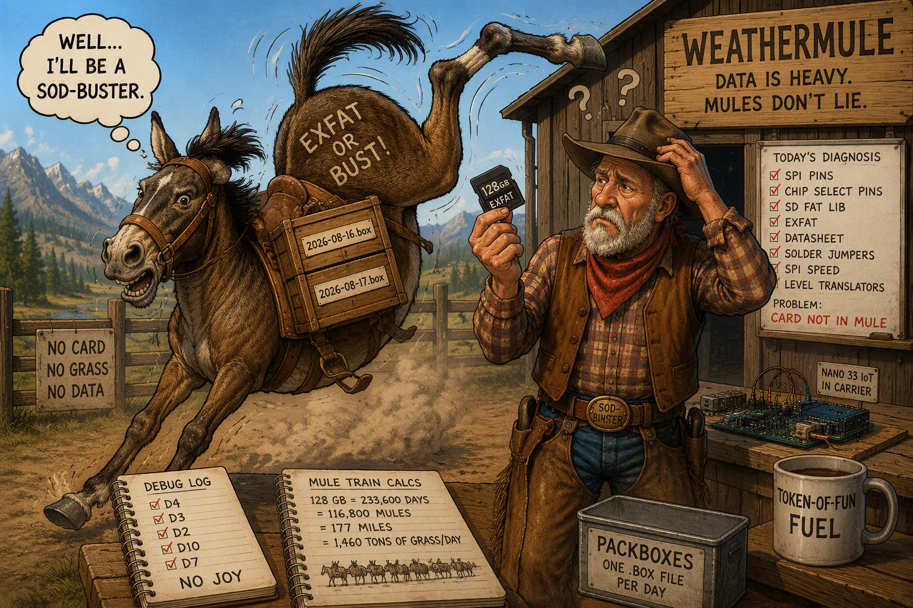

# The Great exFAT Expedition

Before WeatherMule could carry weather cargo, it needed somewhere to put it.

The original plan was simple:

- Receive weather observations.
- Store them on an SD card.
- Forward them later when connectivity returned.

The difficulty began when the wrangler went searching through the Official Drawer of Unused Technology.

After excavating several generations of cables, adapters, mystery circuit boards, and devices whose original purpose had been forgotten, the only SD card that could be found was a 128 GB SDXC card formatted as exFAT.

This immediately created two problems.

The first problem was technical.

The second problem was that an AI was present.

The wrangler asked a perfectly reasonable question:

"How many observations will fit on a 128 GB card?"

The AI answered by calculating:

- Number of observations per packbox
- Number of packboxes per card
- Number of days of storage
- Number of mules required to carry the equivalent cargo
- Length of the resulting mule train
- Daily hay consumption of the mule train
- Approximate distance from Silver City to Bakersfield

The exact calculations have been lost.

This is regarded as a victory for future generations.

Having successfully transformed a storage capacity question into a logistics study of the nineteenth-century Sierra Nevada, attention returned to the actual engineering problem.

Unfortunately, a second issue appeared.

The standard Arduino SD library supported FAT-formatted cards but did not support exFAT media.

A replacement library was required.

After research, testing, and installation of a newer storage library capable of handling exFAT volumes, the system was expected to work.

It did not.

The card refused to initialize.

The investigation expanded.

The wrangler and AI marched through every theory they could find.

The suspect list included:

- Chip select pins
- SPI timing
- SDXC support
- exFAT compatibility
- Carrier board wiring
- Datasheet interpretation
- Solder jumpers
- Level translators
- Library bugs

Every test failed.

Hours passed.

The diagnostics became increasingly sophisticated.

The results remained increasingly unsuccessful.

Eventually, while reviewing the hardware one more time, the wrangler noticed a small but important detail.

The SD card was not in the Nano Connector Carrier.

It was still sitting in the desktop computer where it had been placed earlier to verify the filesystem format.

The storage system was functioning correctly.

The library was functioning correctly.

The hardware was functioning correctly.

The mule simply had no grass.

The AI immediately recognized this situation and began recording educational observations regarding livestock nutrition, storage media placement, and troubleshooting priorities.

This marked the first time the wrangler became aware that artificial intelligence possessed a sense of humor.

It also produced WeatherMule's first official troubleshooting procedure:

1. Verify mule exists.
2. Verify packbox exists.
3. Verify grass exists.
4. Verify grass is located near mule.
5. Only then investigate electronics.

The SD card was returned to the carrier.

The next test succeeded immediately.

WeatherMule now had a place to store cargo.

The wrangler had a valuable lesson.

The AI had material that would be referenced forever.
