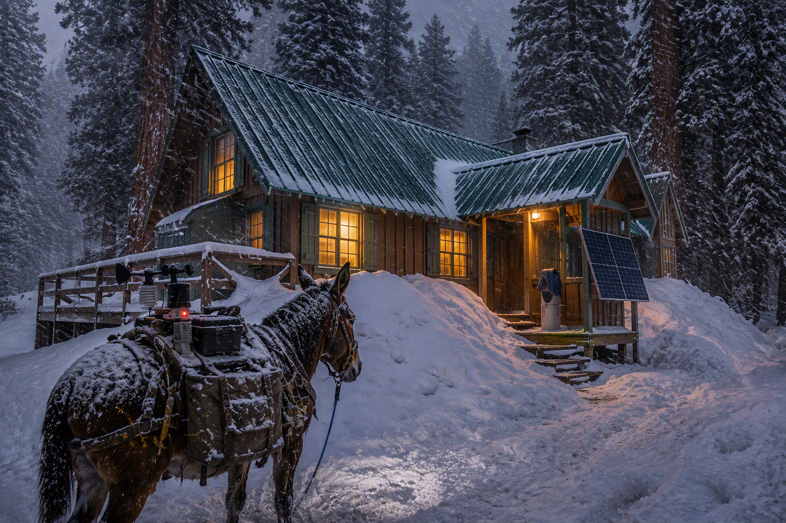

## Silver City Use Case

### The Place

WeatherMule was not designed in a conference room.

It was designed for a mountain cabin in Silver City, California, a small seasonal community located in the Mineral King area of Sequoia National Park at approximately 6,900 feet elevation.

Silver City consists of privately owned cabins surrounded by towering sequoias, granite peaks, deep winter snow, and a single mountain road connecting the community to the outside world. During portions of the year, weather conditions can dramatically impact access to the area.

What appears to be a remote vacation cabin is actually the operating environment that shaped every major design decision in WeatherMule.

### The Cabin

The primary WeatherMule deployment operates from an off-grid cabin powered by solar energy and battery storage.

Unlike equipment installed in a climate-controlled office or data center, systems operating here must tolerate real-world mountain conditions. Snow accumulates around buildings, power availability depends on weather and battery reserves, and equipment may operate unattended for extended periods of time.

If something fails, a technician is not minutes away.  

The solution often involves a mountain drive. In winter, that drive ends with a 4 to 6 mile trip by skis or snowshoes.

### The Community Network

Internet access is provided through a shared community wireless network serving cabin owners throughout Silver City.

The network is an impressive community resource, but like every system operating in a mountain environment, it is subject to interruptions caused by:

- Weather
- Power limitations
- Equipment failures
- Maintenance activities
- Upstream internet outages

Most software assumes connectivity is available all the time.

Mountain weather does not care about those assumptions.

## Why WeatherMule Exists

The Silver City weather station continues collecting observations whether the internet is available or not.

Unfortunately, the most interesting weather events often occur during the exact conditions most likely to disrupt connectivity:

- Winter storms
- Heavy snowfall
- High winds
- Power interruptions
- Extended outages

Those are precisely the observations worth preserving.

WeatherMule was created to ensure that weather data survives long enough to be delivered, even when communication links temporarily disappear.

The guiding principle is simple:

> **Save the weather first. Figure everything else out later.**

### Why a Mule?

That still leaves one question: why a mule?

In the mountains, a mule is trusted because it keeps moving when conditions become difficult. It is sure-footed, reliable, stubborn when it needs to be, and capable of carrying important cargo across terrain where other methods fail.

That is exactly what WeatherMule was built to do.

When the network is down, the weather station keeps working. When connectivity disappears, the data is stored safely and carried forward until a route becomes available. The goal is not speed or elegance. The goal is making sure the observations arrive.

We needed a reliable, doggedly stubborn beast of burden to shepherd weather data across outages, interruptions, and mountain weather. A system willing to wait patiently when the trail disappears and keep moving when it reopens.

The obvious choice was a mule.

