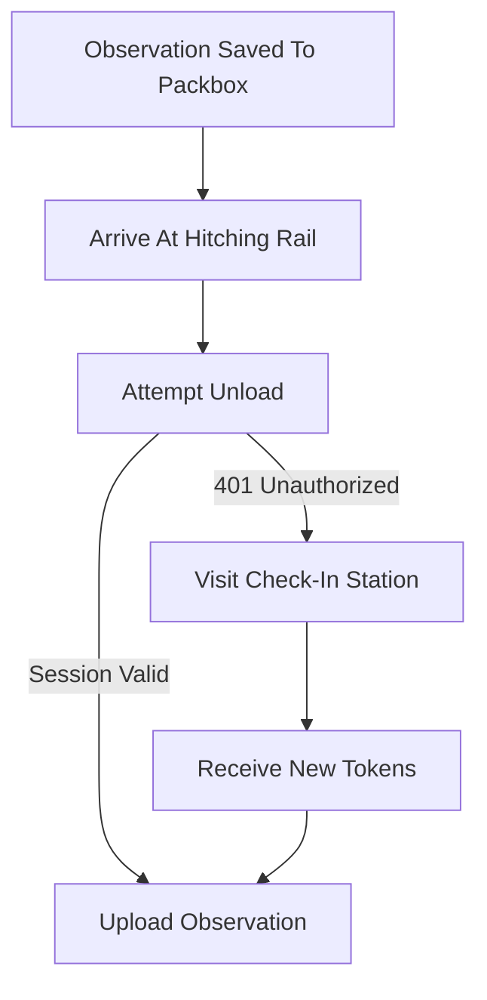
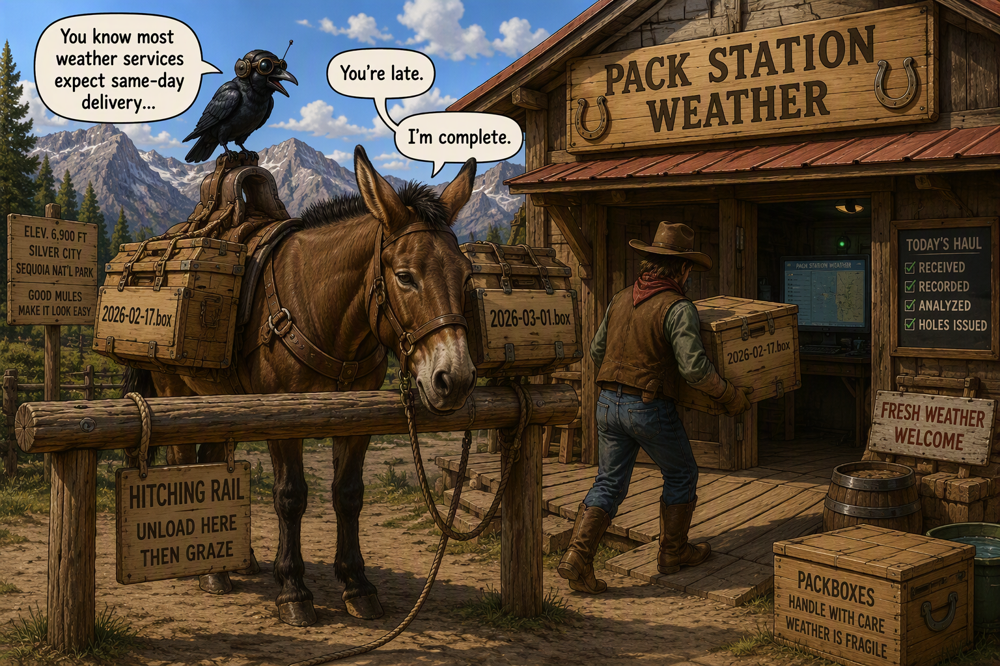
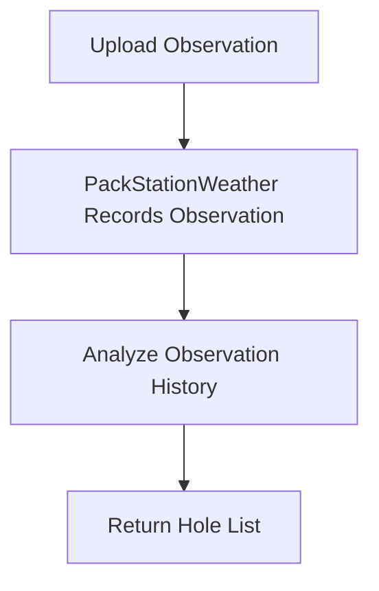

## Unloading Cargo

By the time an observation reaches this stage of the journey, the most important work is already complete.

The weather has been preserved in a packbox.

The observation is safe.

Now the mule attempts delivery.

### The Hitching Rail

*Implementation: [ApiClientRoutines.h](../../ApiClientRoutines.h) [ApiResponse.h](../../ApiResponse.h)* 

Weather observations are delivered through:

```http
POST /api/unload
```

When the mule arrives carrying weather cargo, it first attempts to use its existing session token.

If the session remains valid, the mule unloads immediately.



The check-in station only becomes part of the trip when the mule's travel papers have expired.

Most deliveries never require a check in.



### Unloading Weather

WeatherMule converts the incoming observation into a collection of field/value pairs and submits them to PackStationWeather.  
*Implementation: [WeatherRequest.h](../../WeatherRequest.h)*

The server records the observation and evaluates whether any weather appears to be missing.

If missing observations are detected, the response contains a list of holes.

Conceptually:



One delivery accomplishes two jobs.

The current weather is delivered.

The next recovery tasks are assigned.

### One Source Of Truth

A key design decision was that PackStationWeather owns synchronization state.

WeatherMule does not attempt to determine what observations are missing.

WeatherMule does not attempt to calculate holes.

WeatherMule simply follows the instructions returned by the pack station.

The mule carries cargo.

The pack station keeps the books.

### The Next Job

The hole list returned from an unload operation becomes the mule's next set of work orders.

Those work orders are called holes.

The next chapter explains how the mule searches its packboxes for missing cargo and gradually fills those holes one observation at a time.
