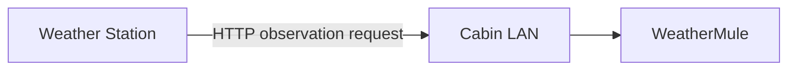
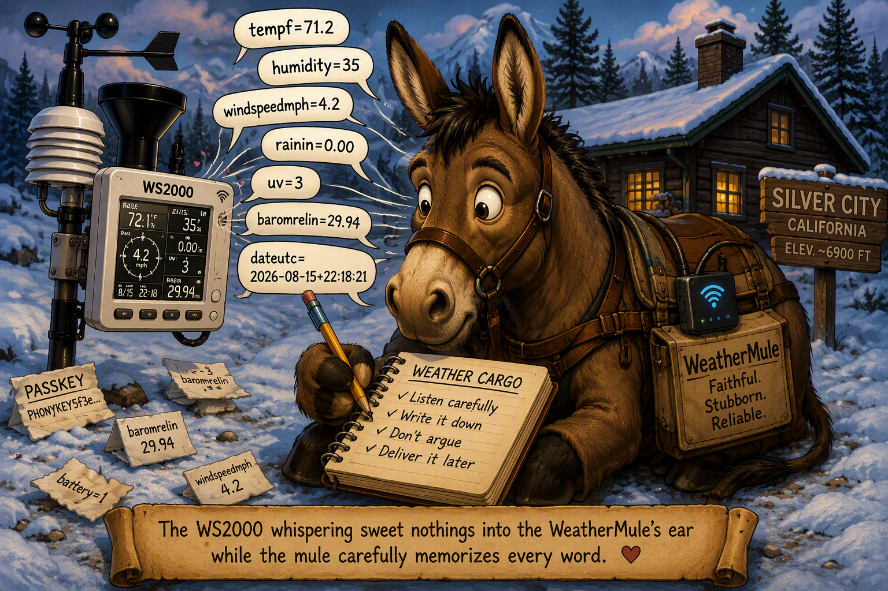
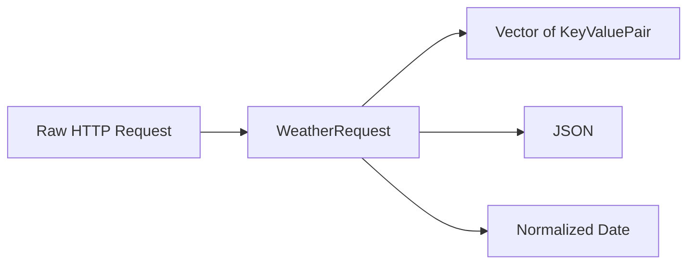
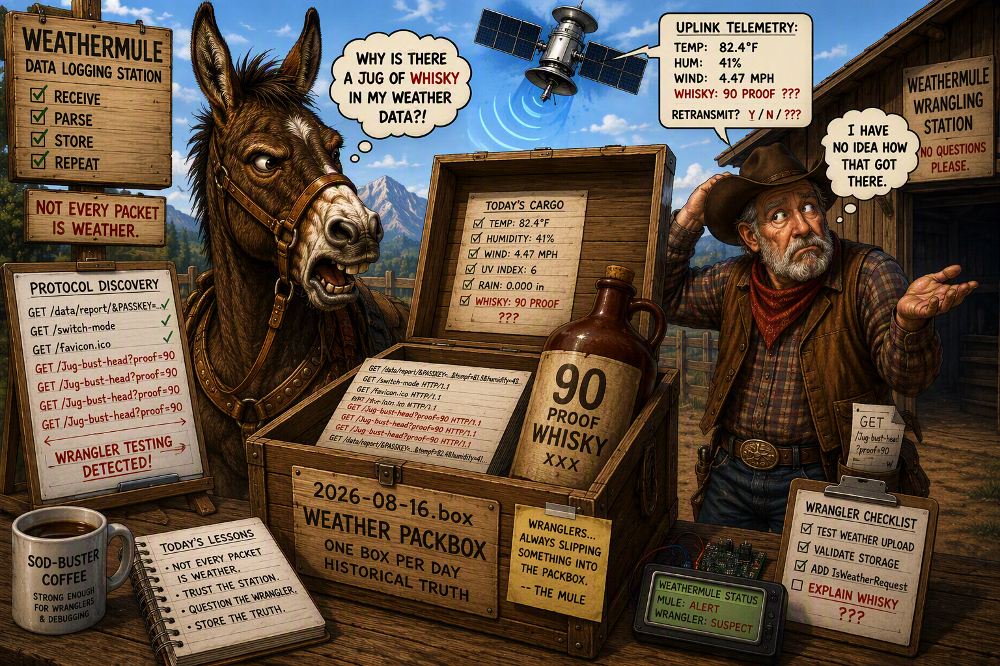

# Weather Station Data

WeatherMule began with a simple question: how could weather observations reach the WeatherMule?

Before observations could be preserved, replayed, or recovered, the mule first had to receive them.

## Finding a Way to Receive the Data

The weather station supported a custom weather server. Instead of sending observations only to a service outside the cabin, it could be configured to send an HTTP request to a server on the local network.

That created an opportunity. The Arduino Nano 33 IoT already included WiFi and could join the cabin LAN. If the Nano hosted a small web server, the weather station could send its observations directly to the mule.

The early arrangement was straightforward:



WeatherMule did not need to poll the weather station or ask whether a new observation was available. The Nano listened for incoming connections, and the weather station delivered each observation as an HTTP request.

For the purpose of the weather station configuration, the mule had become the weather server.



## The First Observation Requests

The incoming request contained the observation data in its URL. A request began with the weather station's reporting path and was followed by a series of named values:

```text
GET /data/report/&PASSKEY=...&dateutc=...&tempf=...&humidity=... HTTP/1.1
```

The complete request contained many measurements and station values, including temperature, humidity, wind, rainfall, pressure, solar radiation, UV, battery status, and the observation timestamp.

Receiving the request proved that the weather station could deliver its observations directly to hardware under our control. The next problem was how to interpret a payload whose size and contents were not fixed.

## Breaking the Request Into Parameters

The observation fields followed a consistent pattern:

```text
name=value
```

Individual fields were separated by ampersands:

```text
tempf=71.2&humidity=35&windspeedmph=4.2&uv=3
```

This made it possible to split the request into individual parameters and then split each parameter into a name and a value.

The early name for these parsed values was `WeatherParam`. As the design developed, it became clear that the structure was not specifically a weather measurement. It was simply a reusable name-and-value pair.

That idea eventually became:

```cpp
class KeyValuePair
{
public:
    String Name;
    String Value;
};
```

## Why Vectors Were Chosen

A traditional Arduino C++ array would have required WeatherMule to decide in advance how many parameters a request could contain:

```cpp
WeatherParam parameters[50];
int parameterCount;
```

That created two separate concerns:

- The array needed a fixed capacity.
- The code needed to track how many positions actually contained parameters.

The number of fields in an observation was not something WeatherMule needed to know ahead of time. Different station models, attached sensors, or later protocol changes could alter the fields being sent.

Using a vector made the number of elements in the collection largely moot:

```cpp
std::vector<KeyValuePair> Properties;
```

As each `name=value` field was parsed, a new `KeyValuePair` could be added to the vector. The parsing code did not need a predefined field count, a separate element counter, or an arbitrary array limit.

The collection grew to match the observation that actually arrived.

### Keeping the Observation Together

The vector solved the problem of storing an unknown number of parameters, but another design question remained: where should the raw request, parsed parameters, and operations performed on them live?

The answer became `WeatherRequest.h`.

A complete line received from the weather station could be passed directly into the class constructor:

```cpp
WeatherRequest weatherRequest(request);
```

The constructor retained the original HTTP request and immediately performed the work required to make the observation useful.

`WeatherRequest` became responsible for:

- Preserving the original HTTP request.
- Determining whether the request contained weather data.
- Parsing the HTTP method and version.
- Extracting the weather station parameters.
- Creating `KeyValuePair` objects.
- Adding those key/value pairs to a vector.
- Retrieving values by parameter name.
- Converting the observation into JSON.
- Converting the weather station timestamp into a normalized date string.

This kept both the observation data and the operations performed on that data in a single class.

For example, the weather station supplied timestamps in this form:

```text
2026-08-15+22:18:21
```

The plus sign separating the date and time was inconvenient for later processing. `WeatherRequest` converted it into:

```text
2026-08-15T22:18:21
```

This allowed the rest of WeatherMule to work with a consistent date format without repeatedly performing string manipulation throughout the codebase.

The resulting relationship became:



An important design principle emerged from this decision:

> **A weather observation and the operations needed to interpret it belong together.**

Rather than passing a raw string throughout the application and repeatedly re-parsing it, WeatherMule could pass a `WeatherRequest` object that already understood how to work with the observation it represented.

### Handling Unknown Fields

Using a vector of key/value pairs removed the need for WeatherMule to know every field that might appear in a weather observation.

The theory sounded good, but theories have a way of collapsing the first time the wrangler starts testing things.

One of the fundamental rules of packing stock is that no matter how much gear needs to be transported, the wrangler will somehow find room for a few bottles of Bust-Head whisky.

To test how resilient the parsing design was, a completely non-weather parameter was introduced:

```text
&bust-head=90-proof
```

When the request reached `WeatherRequest`, the parser treated it exactly like every other parameter.

The result was simply:

```json
{
    "name": "bust-head",
    "value": "90-proof"
}
```

No special handling.

No schema changes.

No parsing failures.

No firmware updates.

No catastrophic mule incidents.

The parser neither knew nor cared that the field had nothing to do with weather observations. It identified a name, identified a value, and added the pair to the collection.

From the parser's perspective:

```text
tempf=71.2
humidity=35
windspeedmph=4.2
bust-head=90-proof
```

were all equally valid name/value pairs.

The experiment demonstrated an important property of the design. WeatherMule was not built around a fixed list of weather fields. It was built around the idea that observations consist of named values whose meaning may not yet be known.

The mule's job was to carry the cargo, not question the manifest.

The only visible side effect was one slightly irritated mule wondering why somebody had packed whisky in a weather report.



## Separating Weather From Other Requests

Hosting a web server introduced another lesson: not every HTTP request reaching the Nano was weather data.

Browsers and testing tools could send unrelated requests to the same server. WeatherMule therefore needed a way to distinguish an observation from other traffic before treating it as weather data.

The weather station's requests used the reporting path:

```text
/data/report/
```

WeatherMule used that path to identify an incoming request as a weather observation. Requests that did not contain the weather reporting path were not treated as observation data.

This kept the parser focused on actual weather station traffic while still allowing the Nano's web server to support other requests during development.

## The Result

By the end of this stage, WeatherMule could:

- Join the cabin LAN using the Nano's built-in WiFi.
- Host a small HTTP server on the local network.
- Receive observation requests sent by the weather station.
- Identify requests that contained weather data.
- Split the request into `name=value` parameters.
- Store those parameters in a dynamically sized vector of key/value pairs.
- Preserve fields without requiring a predefined weather-data structure.

The mule could now receive and understand the weather station's cargo.
