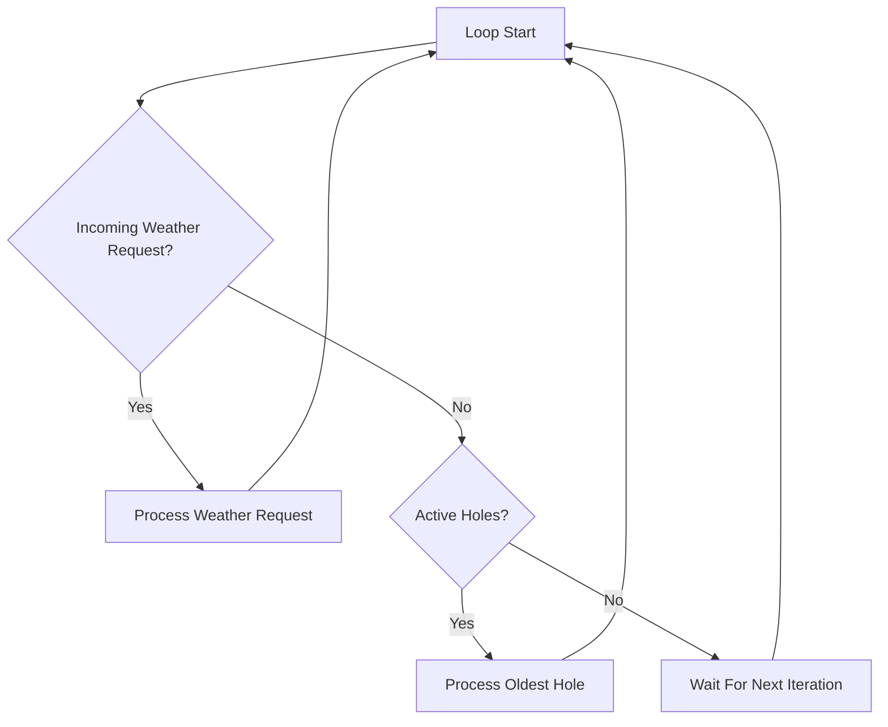

# Application Flow

## Concepts

### What Problem Is Being Solved?

WeatherMule receives weather observations from a weather station and performs two responsibilities:

1. Accept incoming weather station observations.
2. Recover previously missed observations when requested by PackStationWeather.

The application must continuously accept live weather data while also repairing known gaps in historical data.

### Why Does This Subsystem Exist?

The application layer coordinates all WeatherMule activity.

It acts as the scheduler and traffic controller for the device by:

- Initializing hardware and network resources.
- Accepting incoming weather station requests.
- Delegating observation processing.
- Delegating hole recovery processing.
- Maintaining the main execution loop.

Most business logic is implemented elsewhere. The application layer decides what work should happen and when.

### Design Rules

- WeatherMule performs one primary task per loop iteration.
- Live weather observations have priority over hole recovery.
- Startup initialization happens only once.
- Processing logic is delegated to specialized subsystems.
- The application loop remains simple and predictable.
- Long-term state is stored outside the application loop whenever possible.

---

## Workflow

### Startup

When power is applied:

1. Serial logging is initialized.
2. WiFi connection is established.
3. The local HTTP server starts listening.
4. SD card storage is initialized.
5. Device information is written to the serial log.
6. The application enters the main processing loop.

### Main Loop

The application continuously evaluates two possible workloads.

#### Incoming Weather Observation

If an HTTP request is received from the weather station:

1. Accept the connection.
2. Process the weather request.
3. Close the connection.
4. Return to the beginning of the loop.

#### Hole Processing

If no weather request is available and active holes exist:

1. Select the oldest hole.
2. Attempt hole recovery processing.
3. Return to the beginning of the loop.

#### Idle State

If neither condition exists:

1. Continue waiting for work.
2. Restart the loop.

### Processing Priority

Incoming observations always have priority over hole processing.

This prevents historical recovery operations from delaying delivery of newly arriving weather observations.

---

## Implementation

### Primary Source File

*Implementation: [WeatherMule.ino](../../WeatherMule.ino)*

This file contains the application's startup logic and main execution loop.

### Important Functions

#### setup()

Responsible for one-time initialization.

Major responsibilities:

- Start serial communications.
- Connect to WiFi.
- Start HTTP server.
- Initialize SD storage.
- Display startup diagnostics.

#### loop()

The application's operational controller.

Decision sequence:

1. Check for incoming weather station requests.
2. Process weather requests when present.
3. Otherwise process active holes.
4. Repeat indefinitely.

#### MacToString()

Helper routine that converts the device MAC address into a printable string for diagnostics.

### Important Structures

#### WiFiServer server

Local HTTP listener used to receive weather station requests.

#### holeCount

Global count of active holes currently awaiting recovery.

The value is maintained by the hole processing subsystem and used by the main loop to determine whether recovery work exists.

#### sdAvailable

Indicates whether SD card storage initialized successfully during startup.

### Related Subsystems

The application coordinates several specialized subsystems:

| Subsystem | Responsibility |
|------------|----------------|
| WeatherStationRoutines.h | Weather request processing |
| StorageRoutines.h | Packbox storage and retrieval |
| HoleRoutines.h | Hole management and recovery |
| ApiClientRoutines.h | PackStationWeather communication |

The application layer contains minimal business logic. Most operational behavior is delegated to these subsystems.