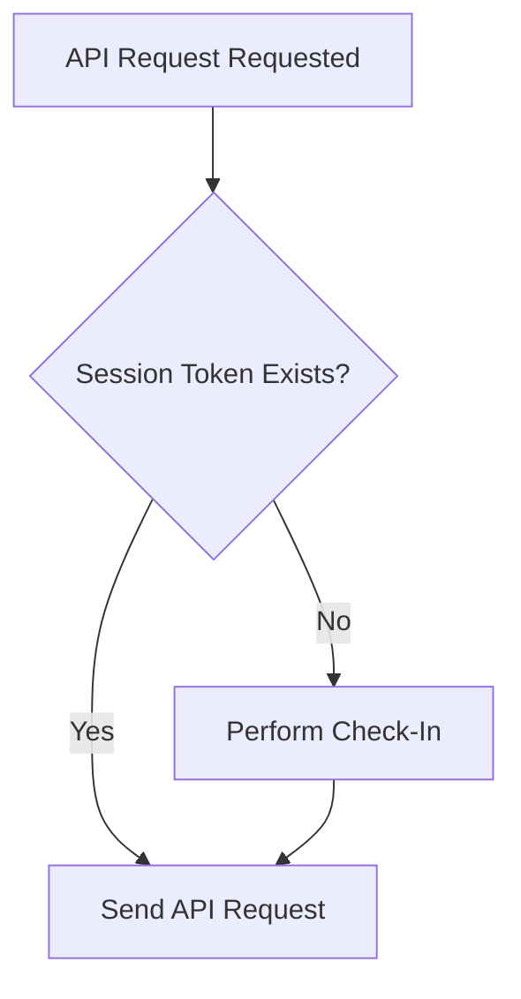
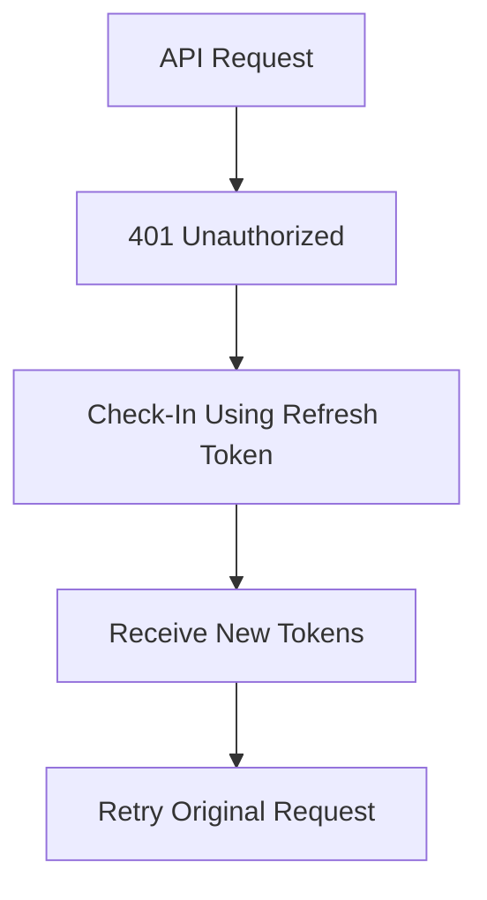

# Authentication Flow

## Concepts

### What Problem Is Being Solved?

WeatherMule must authenticate with PackStationWeather before it can upload observations or perform hole recovery operations.

The authentication subsystem provides a way to:

- Identify the WeatherMule device.
- Obtain temporary credentials.
- Reuse credentials across API requests.
- Recover from expired credentials.
- Minimize exposure of the permanent API key.

### Why Does This Subsystem Exist?

PackStationWeather requires authenticated requests.

Rather than transmitting a permanent API key with every request, WeatherMule obtains temporary credentials and uses those credentials during normal operation.

The authentication subsystem manages the complete credential lifecycle, including:

- Initial check-in.
- Token storage.
- Session renewal.
- Authentication recovery.

### Design Rules

- Authentication occurs only when required.
- Startup does not automatically perform authentication.
- If a valid session token exists, check-in is skipped.
- API requests use the session token whenever possible.
- Refresh tokens are preferred over API keys.
- API keys are used only when necessary.
- Successful authentication replaces previously stored tokens.
- Authentication failures do not remove locally stored observations.
- Authentication state exists only in memory.

---

## Workflow

### Authentication Trigger

Authentication begins when an API operation requires a session token and none is currently available.

Typical operations include:

- Observation uploads.
- Hole fill uploads.
- Not observed notifications.

Before sending a request, WeatherMule checks whether a session token exists.

### Check-In

When no session token exists:

1. Connect to PackStationWeather.
2. Send a GET request to `/api/checkin`.
3. Authenticate using:
   - Refresh token if available.
   - Otherwise API key.
4. Receive credential response.
5. Store returned tokens in memory.

Successful check-in produces:

- Session Token
- Refresh Token

These tokens become the active credentials for future API requests.

### Normal Request Processing

Once authenticated:

1. Build Authorization header.
2. Attach session token.
3. Submit API request.
4. Process response.

Additional check-ins are not required while the session token remains valid.

### Session Expiration

PackStationWeather may reject a request with:

HTTP 401 Unauthorized

When this occurs:

1. Increment authentication attempt counter.
2. Attempt a new check-in.
3. Retry the original request.

### Refresh Token Fallback

During check-in, the refresh token is attempted first when available.

If the refresh token is rejected:

1. Clear the refresh token.
2. Retry check-in using the API key.
3. Obtain a completely new session.

This allows WeatherMule to recover from expired refresh tokens without operator intervention.

### Authentication Failure

Authentication fails when:

- Connection cannot be established.
- API key is rejected.
- Token response is invalid.
- Required tokens are missing.
- Maximum retry attempts are exceeded.

When authentication fails:

- Current API operation fails.
- Existing Packbox data remains intact.
- Future requests may attempt authentication again.

---

## Implementation

### Primary Source File

*Implementation: [ApiClientRoutines.h](../../ApiClientRoutines.h)*  

Contains all authentication logic, token management, authorization header generation, and API retry handling.

### Important Functions

#### CheckInApi()

Primary authentication entry point.

Responsibilities:

- Select authentication credential.
- Request new tokens.
- Validate responses.
- Store credentials.
- Recover from expired refresh tokens.

Called only when authentication is required.

#### PostApi()

Primary API communication routine.

Responsibilities:

- Ensure authentication exists.
- Establish API connection.
- Build request headers.
- Submit requests.
- Detect authentication failures.
- Retry failed requests after re-authentication.

All upload operations ultimately pass through this function.

#### BuildHeaderAuth()

Creates the HTTP Authorization header.

Example:

Authorization: Bearer <token>

#### BuildUserAgent()

Creates the WeatherMule User-Agent string.

Includes:

- WeatherMule name
- WeatherMule version

### Important Structures

#### tokenSession

Current session credential.

Used for normal API operations.

A valid session token prevents additional check-in requests.

*Implementation: [ApiClientRoutines.h](../../ApiClientRoutines.h)*

#### tokenRefresh

Credential used to obtain replacement session tokens.

Used when a session expires.

*Implementation: [ApiClientRoutines.h](../../ApiClientRoutines.h)*

#### authAttempts

Tracks consecutive authentication failures.

Used to prevent infinite retry loops.

*Implementation: [ApiClientRoutines.h](../../ApiClientRoutines.h)*

#### max_AuthAttempts

Maximum permitted authentication retry attempts.

*Implementation: [ApiClientRoutines.h](../../ApiClientRoutines.h)*

### Related API Endpoints

#### GET /api/checkin

Obtains:

- Session Token
- Refresh Token

#### POST /api/unload

Observation upload endpoint.

Requires authentication.

#### POST /api/unload/hole/fill

Hole recovery upload endpoint.

Requires authentication.

#### POST /api/unload/hole/not/observed

Hole completion notification endpoint.

Requires authentication.

### Related Documents

- flow-weather-request.md
- flow-upload-observation.md
- flow-hole-processing.md
- source-map.md