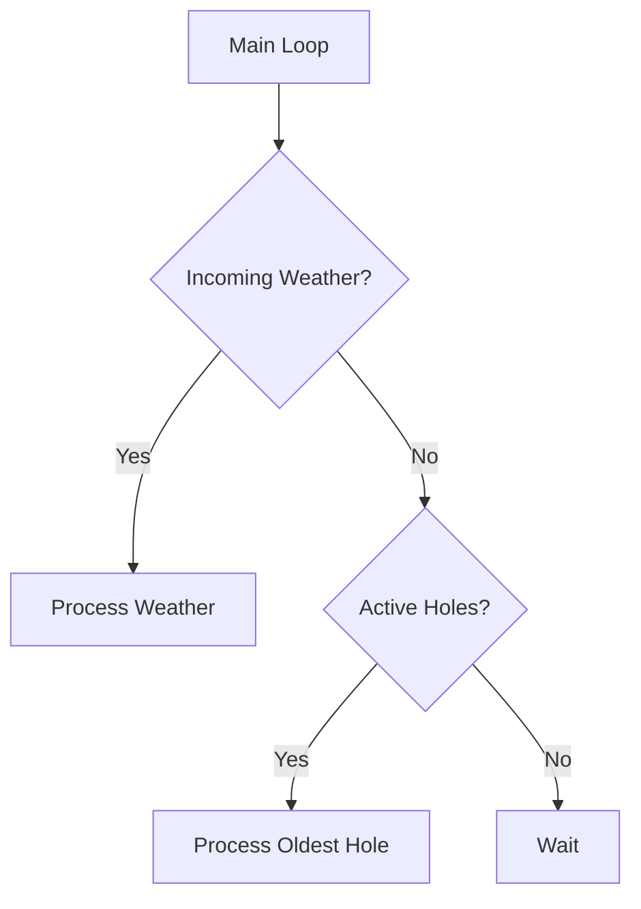
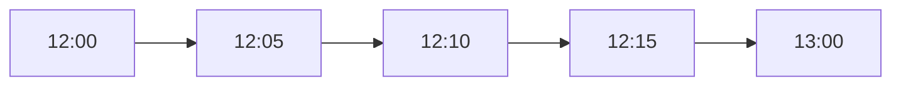

# Hole Processing Flow

## Concepts

### What Problem Is Being Solved?

PackStationWeather may detect gaps in its observation history.

When this occurs, PackStationWeather returns one or more holes describing ranges that require investigation.

The hole processing subsystem is responsible for:

- Processing hole work orders returned by PackStationWeather.
- Locating candidate observations in Packbox storage.
- Replaying observations that fall within a hole.
- Reporting when no observations exist within a requested range.
- Tracking recovery progress.

### Why Does This Subsystem Exist?

WeatherMule stores observations locally even when communication with PackStationWeather is unavailable.

When communication resumes, PackStationWeather can identify gaps in its observation history and request recovery.

The hole processing subsystem provides the mechanism that allows WeatherMule to replay previously stored observations from Packboxes.

### Design Rules

- Fresh weather observations always have priority over hole processing.
- PackStationWeather determines which holes exist.
- WeatherMule does not calculate missing observations.
- A hole identifies two observations already known by both PackStationWeather and WeatherMule.
- Recovery progresses from one known observation toward another known observation.
- Hole processing operates one observation at a time.
- Hole progress is stored inside the Hole object.
- The storage subsystem provides replay operations.
- WeatherMule may abandon current hole progress when a new upload returns a new hole list.

### Understanding a Hole

A hole contains:

```json
{
    "fromUtc": "2026-09-01T12:00:00",
    "toUtc":   "2026-09-01T13:00:00"
}
```

Important:

- PackStationWeather already has the observation identified by `fromUtc`.
- PackStationWeather already has the observation identified by `toUtc`.

The potentially missing observations are the observations between those two timestamps.

This means WeatherMule does not need to calculate where recovery begins or ends.

The hole already provides both boundaries.

---

## Workflow

### Hole Creation

WeatherMule never creates holes.

After a successful observation upload:

1. PackStationWeather evaluates observation history.
2. PackStationWeather identifies any missing ranges.
3. PackStationWeather returns a hole list.
4. WeatherMule replaces its current hole list.

The returned holes become WeatherMule's current recovery workload.

### Hole Selection

When no incoming weather observation exists:

1. Select the oldest hole.
2. Begin processing.
3. Return to the main loop after processing a single observation.

This prevents hole recovery from delaying new weather observations.



### Locating the Starting Observation

The hole's `FromUtc` value identifies a known observation.

WeatherMule:

1. Opens the Packbox containing that observation.
2. Locates the observation matching `FromUtc`.
3. Advances to the next observation.

The observation matching `FromUtc` is never uploaded again because PackStationWeather already possesses it.

### Recovery Candidate Selection

After the `FromUtc` observation is located:

1. Advance to the next observation in storage.
2. Evaluate its timestamp.

Two outcomes are possible.

#### Observation Falls Within The Hole

If:

```text
candidate.dateutc < hole.ToUtc
```

the observation lies inside the hole.

WeatherMule:

1. Sends the observation to `/api/unload/hole/fill`.
2. Advances the hole.
3. Stores recovery progress.

Example:

```text
Hole:
FromUtc = 12:00
ToUtc   = 13:00
```

Located observation:

```text
12:05
```

WeatherMule uploads:

```text
12:05
```

The hole becomes:

```text
FromUtc         = 12:05
ToUtc           = 13:00
PartiallyFilled = true
```

The hole itself acts as the recovery cursor.

### Advancing The Hole

Every successfully replayed observation advances the hole forward.

WeatherMule does not maintain a separate recovery ledger.

Progress is represented entirely by:

- FromUtc
- ByteOffset
- PartiallyFilled

As observations are recovered, the hole gradually shrinks.



The hole advances from one known observation toward the next known observation.

### Reaching The End Of The Hole

Eventually the next observation found in storage matches:

```text
hole.ToUtc
```

Because PackStationWeather already possesses the `ToUtc` observation, it must not be uploaded again.

At this point one of two outcomes occurs.

#### Recovery Successful

If:

```text
candidate.dateutc == hole.ToUtc
```

and

```text
hole.PartiallyFilled == true
```

then one or more observations were recovered.

The hole is complete.

WeatherMule removes the hole.

#### Nothing Was Recorded

If:

```text
candidate.dateutc == hole.ToUtc
```

and

```text
hole.PartiallyFilled == false
```

then no observations were found between the known boundary observations.

WeatherMule reports:

```text
POST /api/unload/hole/not/observed
```

After PackStationWeather acknowledges the result, the hole is removed.

### Storage Bookmark Optimization

Searching from the beginning of a Packbox every time would be inefficient.

To improve recovery performance, each hole stores:

- FromUtc
- ByteOffset
- PartiallyFilled

The storage subsystem uses `ByteOffset` to return directly to the observation represented by `FromUtc`.

The actual recovery position is represented by `FromUtc`.

`ByteOffset` is only a lookup optimization.

---

## Implementation

### Primary Source Files

*Implementation: [HoleRoutines.h](../../HoleRoutines.h)*

Contains hole management, recovery workflow, progress tracking, and completion logic.

*Implementation: [Hole.h](../../Hole.h)*

Defines the Hole structure used to track recovery work.

### Supporting Source Files

*Implementation: [StorageRoutines.h](../../StorageRoutines.h)*

Provides observation lookup, replay services, bookmark validation, and Packbox traversal.

*Implementation: [ApiClientRoutines.h](../../ApiClientRoutines.h)*

Provides hole fill and not-observed API operations.

---

## Important Functions

### ProcessHoles()

Primary hole processing entry point.

Responsibilities:

- Select oldest hole.
- Locate next recovery candidate.
- Submit observations for recovery.
- Remove completed holes.
- Report holes containing no observations.

### OldestHole()

Returns the oldest active hole.

Used to prioritize recovery processing.

### RemoveHole()

Removes a completed hole from the active hole list.

### AddHoles()

Creates hole records returned by PackStationWeather.

### FillHoleApi()

Submits a recovered observation to:

```text
POST /api/unload/hole/fill
```

### NotObservedApi()

Reports that no observations were found inside a hole.

Submits:

```text
POST /api/unload/hole/not/observed
```

---

## Important Structures

### Hole

Represents a recovery work order.

Fields:

```cpp
VendorDeviceKey
FromUtc
ToUtc
PartiallyFilled
ByteOffset
```

*Implementation: [Hole.h](../../Hole.h)*

### Holes[]

In-memory collection of active holes.

Maintained by the hole processing subsystem.

*Implementation: [HoleRoutines.h](../../HoleRoutines.h)*

### WeatherRequest

Represents recovered observations returned from Packbox storage.

Used when sending observations to the hole fill endpoint.

*Implementation: [WeatherRequest.h](../../WeatherRequest.h)*

---

## Related Documents

- flow-storage.md
- flow-upload-observation.md
- flow-authentication.md
- source-map.md