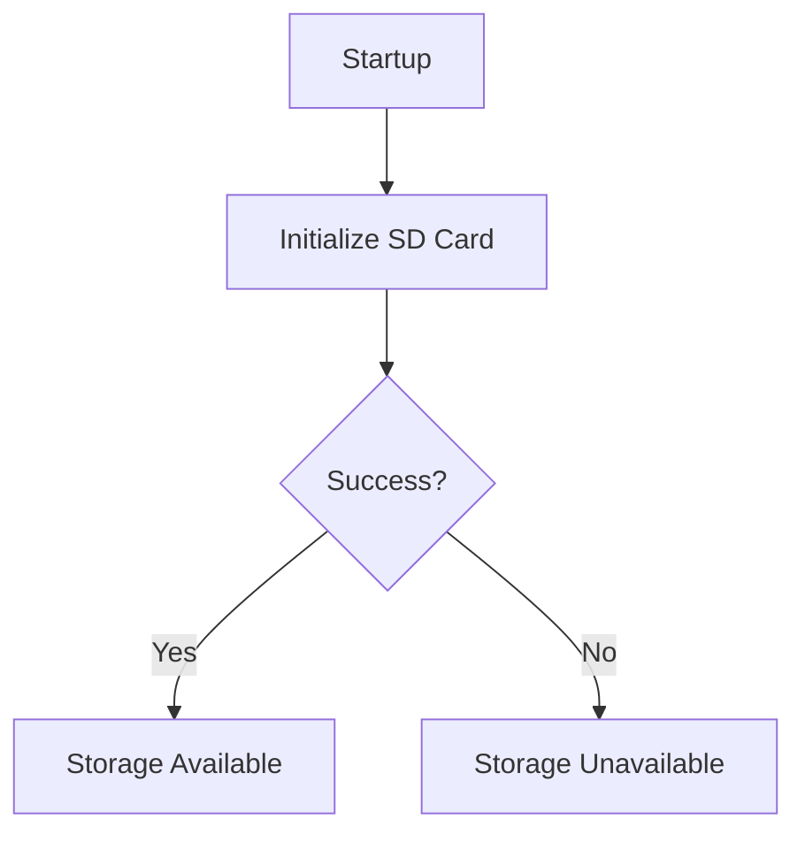
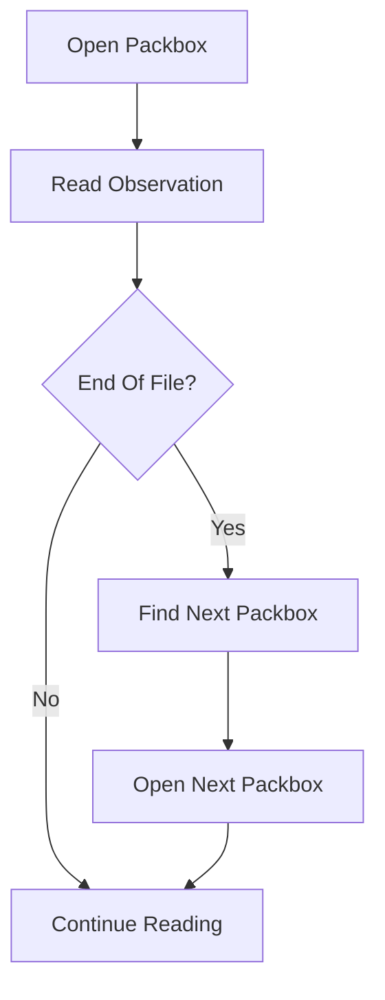

# Storage Flow

## Concepts

### What Problem Is Being Solved?

WeatherMule must preserve weather observations locally regardless of network availability.

The storage subsystem provides:

- Durable local observation storage.
- Recovery after communication outages.
- Recovery after power failures.
- A replay source for hole processing.

Without local storage, observations could be lost whenever PackStationWeather is unavailable.

### Why Does This Subsystem Exist?

WeatherMule operates under the assumption that network connectivity is not always available.

Before an observation can be uploaded, recovered, or replayed, it must first be preserved.

The storage subsystem acts as the device's persistent memory by recording every received observation on the SD card.

It also provides the lookup and replay mechanisms used by hole recovery.

### Design Rules

- Store observations before attempting delivery.
- Preserve the original weather station request.
- Never modify previously written observations.
- Use append-only writes.
- Partition observations into daily Packboxes.
- Keep storage independent from upload success.
- Support recovery after device restart or power loss.
- Allow efficient replay of stored observations.
- Maintain chronological ordering within each Packbox.

---

## Workflow

### Storage Initialization

During startup, WeatherMule initializes SD card access.

If initialization succeeds:

- Storage operations are enabled.
- Observations can be written to Packboxes.
- Hole recovery can access historical observations.

If initialization fails:

- Packbox operations are unavailable.
- Upload operations may still proceed.



### Observation Storage

When a weather observation arrives:

1. Extract the observation timestamp.
2. Convert the timestamp into a Packbox filename.
3. Open the Packbox file.
4. Append the original observation request.
5. Flush the file.
6. Close the file.

The original request is stored exactly as received.

No fields are removed or transformed during storage.

### Packbox Selection

Packboxes are organized by UTC date.

The observation timestamp determines which Packbox receives the observation.

Examples:

```text
2026-08-15.box
2026-08-16.box
2026-08-17.box
```

All observations for a given UTC date are stored in the same Packbox.

### Observation Replay

Hole recovery uses stored observations as its recovery source.

When requested to locate an observation:

1. Determine the Packbox associated with the hole.
2. Open the Packbox.
3. Search for the requested observation.
4. Return observations within the hole range.

The storage subsystem does not decide whether an observation should be replayed.

It only provides access to stored observations.

### Cross-Packbox Recovery

A hole may span multiple Packboxes.

When the end of a Packbox is reached:

1. Locate the next chronological Packbox.
2. Open the next Packbox.
3. Continue reading observations.

This allows recovery to continue across day boundaries.



### Replay Optimization

Repeatedly scanning large Packboxes would become increasingly expensive during hole recovery.

To reduce unnecessary scanning, the storage subsystem maintains recovery bookmarks.

Each partially completed hole stores:

- FromUtc
- ByteOffset
- PartiallyFilled

These values allow future recovery operations to resume near the previous location instead of scanning the Packbox from the beginning.

---

## Implementation

### Primary Source File

*Implementation: [StorageRoutines.h](../../StorageRoutines.h)*

Contains SD card initialization, Packbox storage, observation replay, Packbox discovery, and recovery bookmark handling.

### Supporting Source Files

*Implementation: [Hole](../../Hole.h)*

Provides the recovery bookmark information used during observation replay.

*Implementation: [WeatherRequest.h](../../WeatherRequest.h)*

Provides timestamp extraction and access to the original observation request.

---

## Important Functions

### InitializeStorage()

Initializes SD card access during application startup.

Returns a status indicating whether Packbox functionality is available.

### AppendToBox()

Stores an observation in the appropriate Packbox.

Responsibilities:

- Determine Packbox filename.
- Open Packbox.
- Append observation.
- Flush data.
- Close file.

### ToBoxFileName()

Converts a timestamp into a Packbox filename.

Example:

```text
2026-09-22T18:42:15
```

becomes:

```text
2026-09-22.box
```

### NextBoxFileName()

Locates the next chronological Packbox.

Used when recovery operations reach the end of a file.

### OpenPackboxRead()

Opens the Packbox associated with a hole and retrieves the next candidate observation.

Handles movement between Packboxes when necessary.

### ReadUntil()

Locates observations within the requested hole range.

Responsibilities:

- Locate the current bookmark observation.
- Return the next observation in sequence.
- Update recovery bookmarks.
- Detect hole completion boundaries.

---

## Important Structures

### SdFs

Primary SD card interface.

Responsible for opening, creating, reading, and writing Packboxes.

*Implementation: [StorageRoutines.h](../../StorageRoutines.h)*

### FsFile

Represents an individual Packbox file.

Used for both storage and replay operations.

*Implementation: [StorageRoutines.h](../../StorageRoutines.h)*

### Hole

Represents a recovery task and its current replay state.

Storage-related fields include:

- FromUtc
- ByteOffset
- PartiallyFilled

These fields allow recovery operations to resume from previously processed locations.

*Implementation: [Hole.h](../../Hole.h)*

### WeatherRequest

Represents the original weather station observation.

Provides:

- Request preservation.
- Timestamp access.
- Observation parsing.

*Implementation: [WeatherRequest.h](../../WeatherRequest.h)*

---

## Packbox Format

Each Packbox is a plain text file.

Each line contains one original weather station request.

Example:

```text
GET /data/report/&dateutc=2026-09-22+12:00:00&tempf=72.1 HTTP/1.1
GET /data/report/&dateutc=2026-09-22+12:01:00&tempf=72.3 HTTP/1.1
GET /data/report/&dateutc=2026-09-22+12:02:00&tempf=72.4 HTTP/1.1
```

The storage subsystem never rewrites these records after they are written.

---

## Related Documents

- flow-application.md
- flow-weather-request.md
- flow-upload-observation.md
- flow-hole-processing.md
- source-map.md