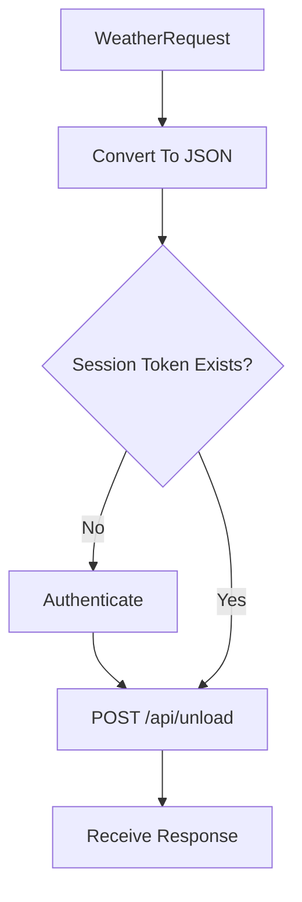

# Upload Observation Flow

## Concepts

### What Problem Is Being Solved?

WeatherMule must deliver locally received weather observations to PackStationWeather.

The upload subsystem is responsible for:

- Converting an observation into an API payload.
- Delivering the payload to PackStationWeather.
- Handling authentication when required.
- Receiving synchronization instructions from the server.
- Updating the local hole list.

Without this subsystem, observations would remain stored only in local Packboxes and would never become part of the central weather record.

### Why Does This Subsystem Exist?

Local storage protects observations from temporary communication failures.

The upload subsystem exists to move those observations from local storage to PackStationWeather whenever network communication is available.

The upload process also serves as the mechanism used to discover missing observations.

Every successful upload allows PackStationWeather to:

- Record the current observation.
- Evaluate synchronization state.
- Return any active holes.

### Design Rules

- Local storage occurs before upload.
- Uploads use authenticated API requests.
- Authentication is obtained only when required.
- Upload operations use the current session token when available.
- PackStationWeather owns synchronization decisions.
- WeatherMule does not calculate holes.
- All uploads replace the current hole list.
- Upload failures never remove observations from Packbox storage.

---

## Workflow

### Upload Trigger

An upload begins when a weather observation is received and processed by the weather request subsystem.

After the observation has been stored locally, the WeatherRequest object is submitted to the upload subsystem.

### Serialize Observation

WeatherRequest converts the weather observation into a JSON payload.

The payload contains the collection of parsed weather station parameters.

Each parameter is represented as a name/value pair.

### Authentication Check

Before transmission:

1. Verify a session token exists.
2. If a session token exists:
   - Continue with upload.
3. If no session token exists:
   - Perform authentication.
   - Obtain new credentials.
   - Continue with upload.

Authentication is performed only when required.

### Upload Request

WeatherMule submits the observation to:

POST /api/unload

The request contains:

- Authorization header
- User-Agent header
- JSON payload

### Server Processing

PackStationWeather receives the observation and processes it.

The upload subsystem is not responsible for determining synchronization status.

Instead, PackStationWeather evaluates:

- Newly received observations.
- Previously received observations.
- Missing observation ranges.

The server returns a response describing any active holes.

### Hole List Update

Before processing the upload response:

1. Remove all existing holes.
2. Parse the server response.
3. Create new hole records.
4. Store the returned holes in memory.

The server response becomes the complete synchronization state known to WeatherMule.

### Unauthorized Response

If PackStationWeather returns:

HTTP 401 Unauthorized

WeatherMule:

1. Performs authentication.
2. Obtains new credentials.
3. Retries the original request.

This process is automatic and transparent to the caller.

### Upload Failure

Upload fails when:

- Network communication fails.
- Authentication fails.
- Response data cannot be parsed.
- Retry limits are exceeded.

When upload fails:

- The observation remains stored in Packbox storage.
- No local observation data is removed.
- Future observations may trigger additional upload attempts.

---

## Implementation

### Primary Source File

*Implementation: [ApiClientRoutines.h](../../ApiClientRoutines.h)*

Contains upload processing, API communication, authentication integration, response handling, and hole list management.

### Supporting Source Files

*Implementation: [WeatherRequest.h](../../WeatherRequest.h)*

Provides observation parsing and JSON serialization.

*Implementation: [ApiResponse.h](../../ApiResponse.h)*

Provides response parsing and access to returned values.

*Implementation: [HoleRoutines.h](../../HoleRoutines.h)*

Provides local hole storage and management.

*Implementation: [Hole.h](../../Hole.h)*

Represents an individual hole returned by PackStationWeather.

### Important Functions

#### UploadApi()

Primary observation upload entry point.

Responsibilities:

- Clear existing holes.
- Upload observation.
- Parse response.
- Update hole list.

This is the function called by the weather request subsystem.

#### PostApi()

Performs all HTTP POST communication.

Responsibilities:

- Verify authentication.
- Create connection.
- Build HTTP request.
- Submit payload.
- Read response.
- Retry after authentication failures.

All observation uploads ultimately pass through this function.

#### AddHoles()

Creates hole records from the server response.

Called after a successful upload.

### Important Structures

#### WeatherRequest

Represents the uploaded observation.

Provides:

- Parsed weather data.
- JSON serialization.
- Timestamp normalization.

*Implementation: [WeatherRequest.h](../../WeatherRequest.h)*

#### ApiResponse

Represents the PackStationWeather response.

Provides:

- JSON extraction.
- Object parsing.
- Value retrieval.

*Implementation: [ApiResponse.h](../../ApiResponse.h)*

#### Hole

Represents a missing observation range returned by PackStationWeather.

Contains:

- VendorDeviceKey
- FromUtc
- ToUtc
- Recovery state information

*Implementation: [Hole.h](../../Hole.h)*

#### Holes[]

In-memory collection of active holes requiring recovery.

Updated after successful uploads.

Implementation: HoleRoutines.h

### API Endpoints

#### POST /api/unload

Receives weather observations and returns the current hole list.

This is the primary observation delivery endpoint.

### Related Documents

- flow-weather-request.md
- flow-authentication.md
- flow-hole-processing.md
- source-map.md