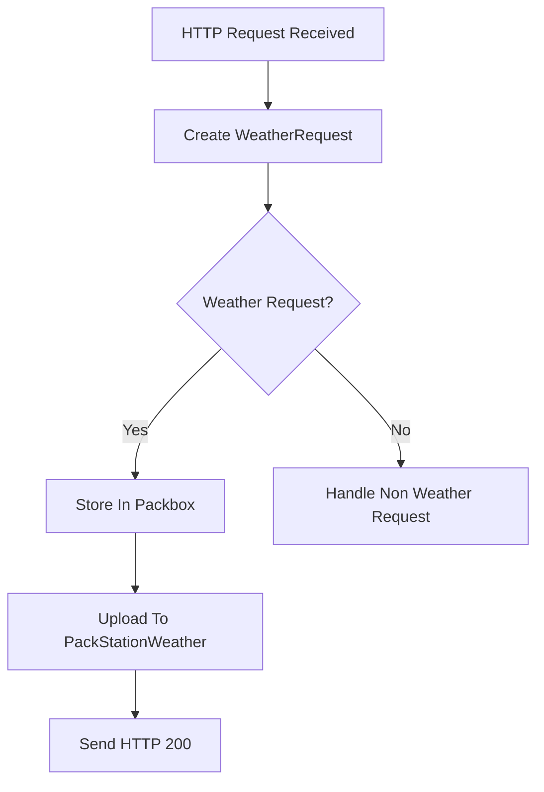

# Weather Request Flow

## Concepts

### What Problem Is Being Solved?

WeatherMule must receive weather observations from the weather station and convert them into a format that can be processed by the rest of the system.

The weather station delivers observations as HTTP requests containing a variable number of name=value parameters. WeatherMule must:

- Accept the incoming HTTP request.
- Determine whether it contains weather data.
- Parse the request into usable structures.
- Preserve the observation locally.
- Attempt delivery to PackStationWeather.
- Return an HTTP response to the weather station.

### Why Does This Subsystem Exist?

The weather request subsystem is the primary entry point for observation data.

Its responsibility is to transform an incoming HTTP request into a structured WeatherRequest object and coordinate the actions required to preserve and deliver the observation.

Without this subsystem, WeatherMule would have no way to receive weather observations from the weather station.

### Design Rules

- Weather observations arrive as HTTP requests.
- Requests are parsed only once.
- The original request is preserved.
- Parsed values remain associated with the original observation.
- WeatherMule attempts local storage and remote delivery independently.
- A failure in one delivery path does not prevent the other.
- Incoming observations take priority over hole processing.
- The subsystem delegates storage and upload responsibilities to specialized components.

---

## Workflow

### Request Arrival

The WeatherMule web server accepts an incoming HTTP connection and reads the first request line.

Example:

GET /data/report/&dateutc=2026-08-15+22:18:21&tempf=71.2 HTTP/1.1

The request line is passed to a WeatherRequest object for parsing.

### Request Classification

WeatherRequest determines whether the request represents a weather observation.

A request is considered a weather observation when it contains:

/data/report/

If the request does not contain the weather reporting path, WeatherMule evaluates it as a non-weather request.

### Weather Observation Processing

When a weather observation is detected:

1. Create a WeatherRequest object.
2. Parse all request parameters.
3. Store the observation in a Packbox.
4. Attempt upload to PackStationWeather.
5. Return an HTTP response to the weather station.
6. Log processing results.

### Observation Storage

WeatherMule attempts to store every weather observation in local Packbox storage.

Storage occurs before upload processing.

This provides a local recovery source if communication with PackStationWeather becomes unavailable.

### Observation Upload

After local storage, WeatherMule attempts to upload the observation to PackStationWeather.

The upload subsystem is responsible for:

- Authentication.
- API communication.
- Hole discovery.
- Hole list updates.

The weather request subsystem only initiates the upload.

### Response Generation

If either local storage or upload succeeds:

- HTTP 200 is returned.

If neither operation succeeds:

- HTTP 500 is returned.

This behavior allows observations to be accepted when at least one preservation mechanism remains available.

### Non-Weather Requests

Requests that do not contain weather data are handled separately.

Current supported requests include:

- /logging/on
- /logging/off

These requests control diagnostic logging.

Unknown requests return:

- HTTP 404 Not Found

---

## Implementation

### Primary Source File  
*Implementation: [WeatherStationRoutines.h](../../WeatherStationRoutines.h)*  
This file contains the request processing workflow, response generation, and request routing logic.

### Supporting Source Files

*Implementation: [WeatherRequest.h](../../WeatherRequest.h)*  
Responsible for parsing and representing weather observations.

*Implementation: [KeyValuePair.h](../../KeyValuePair.h)*  
Represents individual name=value request parameters.

*Implementation: [StorageRoutines.h](../../StorageRoutines.h)*  
Provides Packbox storage IO services.

*Implementation: [ApiClientRoutines.h](../../ApiClientRoutines.h)*  
Provides upload and authentication services.

### Important Functions

#### ProcessWeatherStationRequest()

Primary entry point for all incoming HTTP requests.

Responsibilities:

- Read request data.
- Create WeatherRequest.
- Classify request type.
- Execute observation workflow.
- Execute logging commands.
- Generate HTTP responses.

#### SendStatusResponse()

Creates HTTP status responses returned to clients.

Used by all response helper functions.

#### Send200()

Returns:

HTTP/1.1 200 OK

#### Send404()

Returns:

HTTP/1.1 404 Not Found

#### Send500()

Returns:

HTTP/1.1 500 Internal Server Error

#### SendDesignModeResponse()

Returns a simple HTML page displaying the current design-mode state.

### Important Structures

#### WeatherRequest

Represents a parsed weather observation.

Responsibilities include:

- Preserving the original request.
- Parsing request parameters.
- Detecting weather observations.
- Returning parameter values.
- Producing JSON payloads.
- Producing normalized timestamps.

*Implementation: [WeatherRequest.h](../../WeatherRequest.h)*

#### KeyValuePair

Represents a single parameter from the weather station request.

Example:

name=tempf
value=71.2

*Implementation: [KeyValuePair.h](../../KeyValuePair.h)*

#### WiFiClient

Represents the active HTTP connection between the weather station and WeatherMule.

Used throughout request processing and response generation.

### Related Documents

- flow-upload-observation.md
- flow-authentication.md
- flow-hole-processing.md
- protocol-discovery.md
- source-map.md